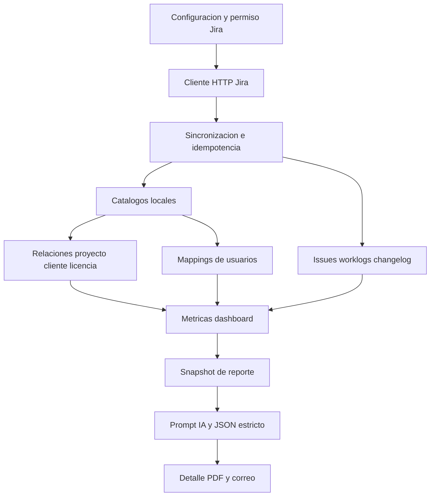

# Plan de accion - Modulo Jira para Opzio ERP

**Estado:** implementación inicial completada / documento vivo
**Fecha del analisis:** 2026-09-08
**Alcance:** `opzio_erp`, tomando `opzio_crm` como referencia para el modulo de reportes con IA
**Objetivo de esta etapa:** conservar la guia de implementacion y registrar el estado verificable del modulo Jira

> Este documento separa los hechos comprobados en el repositorio de las decisiones propuestas. Todo nombre que no exista actualmente en el codigo aparece como propuesta.

### Estado actual de implementación

La primera implementación funcional ya está integrada en `opzio_erp`:

- configuración Jira Cloud con API token cifrado, prueba de conexión y sincronización manual;
- una tabla singleton para la configuración Jira, además de ejecuciones, proyectos, usuarios, issues, worklogs, changelogs, relaciones y reportes;
- cliente HTTP Jira Cloud v3 con paginación, reintentos y mensajes sanitizados;
- comando `jira:sync` y ejecución programada cada hora para actualizar la única conexión activa;
- pestañas de Configuración, Relaciones, Dashboard y Reportes dentro del layout ERP;
- relaciones proyecto/cliente/licencia, épica/licencia y usuario Jira/usuario o empleado ERP;
- métricas filtrables por fechas, proyecto, épica y usuario, separando Story Points de horas;
- reportes IA persistidos con selector de fuentes, snapshot, JSON estricto, regeneración, PDF, correo y eliminación lógica;
- prueba Feature de sincronización idempotente y métricas, con 3 pruebas y 27 aserciones.

Pendiente de validación antes de producción: credenciales y permisos de un workspace Jira real, diferencias entre proyectos team-managed/company-managed, volumen y límites de API, ejecución del worker de colas para procesos largos y definición final de permisos operativos por acción.

---

## 1. Resumen ejecutivo

El modulo Jira debe construirse dentro de `opzio_erp`, conservando su flujo administrativo actual:

- rutas bajo el grupo `admin` protegido por `admin_middleware`;
- pagina Blade que extiende `erp.layouts.app`;
- entrypoint JavaScript y estilos Sass propios del modulo cargados con Vite;
- controladores delgados que delegan la logica en traits, como ocurre en la mayoria de los modulos ERP;
- modelos Eloquent y migraciones Laravel;
- permisos registrados en `user_permissions` y asignados mediante `user_permission_assocs`;
- pruebas Feature/Unit y validacion con `php artisan view:cache`, `npm run build` y `php artisan route:list`.

La recomendacion principal es que Jira tenga una **copia local normalizada de lectura**. Jira continuara siendo la fuente de verdad, pero el ERP almacenara proyectos, usuarios, issues, worklogs e historial suficiente para:

1. consultar el dashboard sin depender de Jira en cada carga;
2. filtrar por fechas y agrupar de forma reproducible;
3. conservar el contexto exacto usado por un reporte IA;
4. repetir sincronizaciones de forma idempotente;
5. detectar errores, datos faltantes y antiguedad de la informacion.

La primera version debe usar sincronizacion por polling contra Jira Cloud REST API v3, con una conexion configurada desde el ERP. Webhooks, Jira Data Center, edicion de issues desde el ERP y cruces financieros quedan fuera hasta validar los requisitos correspondientes.

### Decisiones base recomendadas

1. No reutilizar `App\Domain\Servers\Models\servers_project`: esa entidad representa proyectos de observabilidad de servidores, no proyectos Jira.
2. Crear modelos y tablas con prefijo `jira_` en `app/Models` y `database/migrations`, siguiendo la organizacion legacy del ERP.
3. Encapsular las llamadas HTTP en `app/Services/Jira`, siguiendo el patron de `app/Services/Tenders/tenders_ai_client.php`.
4. Mantener la logica de pagina y validacion cerca de los traits del modulo, pero separar cliente HTTP, sincronizacion, metricas y reportes para evitar un trait monolitico.
5. Adoptar del CRM el patron de reportes persistidos con `snapshot` JSON, estado de generacion, respuesta estructurada y regeneracion, pero adaptarlo a la autenticacion, permisos, correo y PDF del ERP.
6. Definir explicitamente que significa "esfuerzo en Story Points" antes de mostrar el primer KPI. Story Points son estimaciones de issues; no equivalen a horas trabajadas ni pueden sumarse por cada worklog sin duplicar el issue.

---

## 2. Analisis de la estructura actual del ERP

### 2.1 Superficie web y layout

Hechos verificados en el ERP:

- `routes/web.php` importa controladores con nombres legacy, por ejemplo `dashboard_controller`, `licenses_controller` y `servers_dashboard_controller`.
- Las rutas administrativas estan dentro de `Route::prefix('admin')` y `admin_middleware`.
- Las paginas principales se resuelven desde `app/Http/Controllers/admin_pages_controller.php`, que devuelve vistas como `erp.dashboard`, `erp.reports` y `erp.servers`.
- `resources/views/erp/layouts/app.blade.php` compone el sidebar, header y `#erp-app-content`.
- `resources/views/erp/layouts/sidebar.blade.php` contiene los enlaces y las verificaciones de permisos de navegacion.
- Cada modulo suele tener una vista raiz, una carpeta de parciales, un entrypoint JS y uno o varios archivos Sass.

Patron a seguir para Jira:

```text
resources/views/erp/jira.blade.php
resources/views/erp/jira/configuration.blade.php
resources/views/erp/jira/relations.blade.php
resources/views/erp/jira/dashboard.blade.php
resources/views/erp/jira/reports/*.blade.php
resources/js/erp/jira/jira.js
resources/js/erp/jira/*.js
resources/sass/erp/jira/jira.scss
resources/sass/erp/jira/_*.scss
```

La vista raiz debe ser el compositor de las cuatro pestañas. La navegacion debe usar el patron Bootstrap de tabs ya presente en `erp.clients`, `erp.employees` y `erp.servers`, manteniendo IDs estables para no acoplar innecesariamente el JS al markup.

### 2.2 Controladores, traits y servicios

Hechos verificados:

- Los CRUD legacy usan un controlador pequeno y un trait, por ejemplo `clients_controller` + `clients_trait` y `licenses_controller` + `licenses_trait`.
- El dashboard usa `dashboard_controller` y combina `incomes_trait`, `outcomes_trait`, `clients_trait` y `licenses_trait`.
- El modulo Servidores introduce una separacion mas moderna: controlador especifico, modelos bajo `app/Domain/Servers`, servicios y consultas especializadas.
- El modulo Licitaciones usa `app/Services/Tenders/tenders_ai_client.php` para las llamadas HTTP con `Http`, configuracion en `config/services.php` y respuestas normalizadas.

Propuesta para Jira:

```text
app/Http/Controllers/jira_controller.php
app/traits/jira_configuration_trait.php
app/traits/jira_relations_trait.php
app/traits/jira_dashboard_trait.php
app/traits/jira_reports_trait.php
app/Services/Jira/jira_client.php
app/Services/Jira/jira_sync_service.php
app/Services/Jira/jira_metrics_service.php
app/Services/Jira/jira_report_service.php
```

`jira_controller` debe orquestar la pagina y devolver respuestas del estilo ya usado en el ERP. Los traits pueden concentrar autorizacion, validacion y armado de payloads de cada pestaña. Los servicios deben concentrar reglas que no pertenecen a la capa HTTP:

- `jira_client`: autenticacion, endpoints, paginacion, reintentos y normalizacion basica de respuestas HTTP;
- `jira_sync_service`: catalogos, issues, worklogs, changelog, upserts y `jira_sync_runs`;
- `jira_metrics_service`: consultas agregadas para dashboard y snapshot de reportes;
- `jira_report_service`: criterios, selector de datos, prompt, esquema JSON y normalizacion del resultado.

No se recomienda crear `app/Domain/Jira` en la primera iteracion. Esa estructura solo deberia aparecer si el modulo desarrolla un dominio aislado comparable al de Servidores. La propuesta inicial aprovecha `app/Models`, `app/Services/Jira` y traits, que son los patrones mas cercanos y menos disruptivos para este ERP.

### 2.3 Persistencia y alcance de datos del ERP

Entidades comprobadas:

| Entidad | Tabla | Datos relevantes comprobados | Relacion existente |
| --- | --- | --- | --- |
| Cliente | `clients` | `id`, `unique_id`, `name`, `lastname`, `email`, `active`, descripcion | `client::licenses()` |
| Licencia | `licenses` | `id`, `unique_id`, `client_id`, `name`, `service_id`, `employee_id`, estado, valor, fechas de cobro | `license::client()`, `employee()`, `service()` |
| Empleado | `employees` | `id`, `uid`, `name`, `last_name`, `personal_email`, `work_email`, `state`, departamento y cargo en migraciones posteriores | modelo con SoftDeletes |
| Usuario ERP | `users` | `id`, `unique_id`, `name`, `lastname`, `username`, `email`, estado legacy y permisos asociados | `user_permission_assocs` |
| Proyecto de servidores | `servers_projects` | `key`, `name`, `client_id`, host y metadatos de infraestructura | pertenece a Servidores, no a Jira |

El ERP no tiene en estos modulos legacy un `company_id` ni el servicio `CurrentCompany` que si existen en el CRM. Tampoco hay una entidad generica de proyecto de negocio. Por tanto, la primera version debe documentar una de estas decisiones:

- **Recomendacion inicial:** una conexion Jira pertenece a la instalacion/base de datos del ERP y sus proyectos se relacionan con los clientes globales de esa instalacion.
- **Alternativa futura:** introducir un contexto de empresa y `company_id` en todas las tablas Jira. No debe hacerse solo para Jira sin definir la estrategia de migracion del resto del ERP.

No se debe presentar en la interfaz una separacion multiempresa hasta que esa decision exista en el ERP.

### 2.4 Configuracion e integraciones externas

Hechos verificados:

- `config/services.php` contiene credenciales globales para OpenAI, NINI, web integration, servidores, PDF y el servicio de Licitaciones.
- `tenders_ai_client` lee base URL, token, tenant y timeout desde configuracion y maneja errores de conexion sin exponer secretos.
- Para credenciales por registro, el CRM usa `AdConnection` con `credentials` casteado como `encrypted:array`; el formulario deja vacio un secreto para conservar el valor cifrado.
- En el ERP legacy tambien existe uso de `encrypt`/`decrypt` para valores sensibles de pasarelas de pago.

La configuracion Jira debe vivir en una tabla porque la pestaña solicitada debe permitir administrar la conexion desde el ERP. `config/services.php` debe reservarse para valores por defecto de transporte, no para el token del workspace:

```php
'jira' => [
    'timeout' => env('JIRA_TIMEOUT', 30),
    'retries' => (int) env('JIRA_RETRIES', 2),
    'base_url' => env('JIRA_BASE_URL', 'https://your-domain.atlassian.net'),
],
```

La forma exacta del bloque queda pendiente de la decision Cloud/Data Center.

### 2.5 Dashboards, CRUD y frontend

Hechos verificados:

- `erp.dashboard` incluye parciales de indicadores, tablas y graficas.
- `resources/js/erp/dashboard` separa estado, graficas, indicadores, recurrencia y tablas.
- El dashboard existente consulta endpoints POST y usa Chart.js.
- `erp.reports` usa `resources/js/erp/reports` y daterangepicker para graficas filtrables.
- El modulo Servidores muestra un ejemplo reciente de estado JS, filtros, orden, paginacion, exportacion y carga incremental.
- Los CRUD legacy usan tablas, modales, formularios Bootstrap, endpoints POST y respuestas con `status`/`message`.

Jira debe mantener esa combinacion: filtros y formularios server-rendered cuando sea suficiente, llamadas JS para dashboard, sincronizacion y relaciones, y componentes Chart.js para las visualizaciones.

### 2.6 Pruebas y validaciones disponibles

El ERP tiene pruebas Feature para Dashboard, Servidores, Licitaciones, contratos y notificaciones, y pruebas Unit para traits y servicios. El CRM incluye `ReportsModuleTest` y `AdvertisingModuleTest`, que sirven como referencia para:

- falsificar llamadas HTTP;
- construir datos de prueba;
- verificar snapshots;
- probar PDF, correo, permisos y aislamiento;
- comprobar idempotencia.

La implementacion Jira debe agregar pruebas propias; no se debe usar el SQL o los datos de `public/adminer.sql` como contrato de aplicacion.

---

## 3. Analisis del modulo de reportes del CRM

### 3.1 Estructura comprobada

El CRM implementa el modulo en:

```text
opzio_crm/app/Http/Controllers/reports_controller.php
opzio_crm/app/traits/reports_trait.php
opzio_crm/app/Models/AdvertisingReport.php
opzio_crm/database/migrations/2026_08_31_000001_create_advertising_reports_table.php
opzio_crm/resources/views/reports/index.blade.php
opzio_crm/resources/views/reports/create.blade.php
opzio_crm/resources/views/reports/show.blade.php
```

Las rutas tienen este flujo:

```text
GET  /reports
GET  /reports/create
POST /reports
GET  /reports/{report}
POST /reports/{report}/regenerate
GET  /reports/{report}/pdf
POST /reports/{report}/email
```

`AdvertisingReport` persiste:

- identificador publico UUID;
- usuario creador y conexion publicitaria;
- titulo, objetivo, fechas y fuentes;
- contexto introducido por el usuario;
- estado `generated`, `generating` o `failed`;
- `data_snapshot` JSON con cifras consolidadas;
- `report_data` JSON con la respuesta de IA normalizada;
- modelo, response ID, mensaje de error y fechas de generacion/envio;
- SoftDeletes.

### 3.2 Conceptos reutilizables

El modulo Jira debe reutilizar conceptualmente:

1. **Intencion:** catalogo de objetivos que define que debe responder la IA, separado de los datos.
2. **Contexto:** texto opcional del usuario que orienta la lectura sin reemplazar las cifras.
3. **Selector de datos:** fuentes seleccionables y validadas; en Jira debe ser mas granular que `advertising`, `leads` y `forms`.
4. **Snapshot inmutable por reporte:** el resultado conserva exactamente los datos que la IA recibio.
5. **Estado de generacion:** se registra el proceso, el fallo y el mensaje visible sin perder el criterio original.
6. **Respuesta JSON estricta:** el CRM usa `OpenIA_MakeQuestion` con `json_schema`, luego parsea y normaliza.
7. **Detalle legible:** resumen, hallazgos, analisis, recomendaciones, proximos pasos y limitaciones.
8. **Regeneracion:** usa el mismo criterio guardado en el reporte, no vuelve a depender de los controles actuales de la pantalla.
9. **PDF y correo:** el CRM genera PDF desde la vista persistida y envia el archivo usando correo en cola.
10. **Pruebas de integracion:** `ReportsModuleTest` verifica el snapshot, el payload IA, los graficos, el PDF y el correo.

### 3.3 Adaptaciones obligatorias para el ERP

No se debe copiar el trait CRM literalmente porque los proyectos tienen arquitecturas distintas:

- CRM usa `auth`, roles, permisos por slug y `BelongsToCompany`; ERP usa sesion `user`, `admin_middleware` y `user_permission_assocs`.
- CRM usa modelos con nombres PascalCase y relaciones a `companies`; ERP usa nombres legacy en minuscula y datos globales.
- ERP ya tiene `open_ia_trait`, `pdf_trait` y `mail_trait`; esos mecanismos deben ser la integracion primaria.
- El ERP no tiene el layout `layouts.app` del CRM ni sus componentes de breadcrumbs.
- La tabla de reportes Jira debe apuntar a `users` del ERP, no a `App\Models\User` del CRM.

---

## 4. Diseno funcional de las pestañas

## 4.1 Configuracion

### Objetivo

Permitir crear, editar, probar y sincronizar una conexion con un workspace Jira sin mostrar credenciales secretas.

### Alcance propuesto para la primera version

Soportar Jira Cloud mediante API token, con estos campos:

- nombre interno de la conexion;
- URL base del sitio, por ejemplo `https://empresa.atlassian.net`;
- correo del usuario tecnico;
- API token;
- modo o proveedor, inicialmente `jira_cloud`;
- dias de sincronizacion inicial/incremental;
- zona horaria del workspace, si Jira no la devuelve de forma confiable;
- estado: borrador, activo, pausado o con error;
- fecha de ultima prueba y ultima sincronizacion;
- mensaje de error de ultima operacion.

El soporte de OAuth, Jira Server/Data Center, multiples workspaces y rotacion automatica de tokens debe quedar como decision pendiente. No deben aparecer como opciones funcionales hasta contar con un contrato probado.

### Flujo

1. El usuario con permiso de configuracion abre Jira.
2. Ingresa URL, correo y token.
3. El backend valida formato y guarda el token con `encrypted:array`.
4. La accion **Probar conexion** consulta `myself`, proyectos y metadatos de campos.
5. Si la prueba es correcta, se registra el usuario Jira, nombre del sitio y estado activo.
6. La accion **Sincronizar** ejecuta una sincronizacion manual con rango controlado.
7. La pantalla muestra estado, ultimo resultado, cantidad de registros y errores sin incluir token ni headers.
8. Al editar, un campo secreto vacio conserva la credencial existente; solo un nuevo valor la reemplaza.

### Seguridad

- Nunca enviar el token a Blade ni a JavaScript una vez guardado.
- No incluir headers de autenticacion en logs, traceability ni mensajes de excepcion.
- Limitar longitud de URL, correo, token y configuracion.
- Normalizar URL y rechazar esquemas distintos de `https` en produccion.
- Usar timeout y reintentos limitados.
- Mostrar solo un mensaje seguro al usuario; guardar el detalle tecnico sanitizado en `jira_sync_runs` o log.

## 4.2 Relaciones

### Proyecto / Cliente / Licencias

La pantalla debe mostrar los proyectos Jira sincronizados, con busqueda por clave/nombre y estado de relacion.

Flujo recomendado:

1. Seleccionar proyecto Jira.
2. Seleccionar uno o mas clientes ERP.
3. Para cada cliente, seleccionar sus licencias existentes.
4. Guardar la relacion validando que cada licencia pertenezca a un cliente seleccionado.
5. Mostrar cantidad de licencias asociadas y cantidad de issues/epicas sin clasificar.

Aunque la relacion habitual sera un proyecto Jira con un cliente, se recomienda modelar la tabla de proyecto-cliente como many-to-many para no bloquear proyectos compartidos. La interfaz puede empezar permitiendo un cliente principal y dejar abierta la cardinalidad en backend.

Para las epicas se propone una segunda capa de asignacion:

- por defecto, una epica hereda cliente y licencias del proyecto;
- opcionalmente, una epica puede apuntar a otra licencia del mismo cliente;
- si se necesita repartir un proyecto entre clientes o licencias, la asignacion de epica tiene precedencia sobre la del proyecto;
- toda regla de precedencia debe ser visible en el detalle y en el snapshot del reporte.

### Usuarios Jira / Empleados / Usuarios ERP

La pantalla debe listar usuarios Jira descubiertos por proyectos, issues y worklogs, con:

- `account_id` Jira;
- nombre visible;
- correo si Jira lo permite;
- estado activo;
- ultima sincronizacion;
- usuario ERP asociado o empleado ERP asociado.

Cada usuario Jira debe mapearse a **un** destino local inicial: `employee_id` o `user_id`. La aplicacion debe impedir guardar ambos vacios o ambos llenos. El correo solo debe servir como sugerencia; la privacidad de Jira puede ocultarlo o cambiarlo, por lo que la confirmacion manual es obligatoria.

### Relaciones adicionales propuestas, no asumir existentes

| Relacion propuesta | Utilidad | Recomendacion |
| --- | --- | --- |
| Epica Jira -> licencia ERP | Permite atribuir tareas de una epica a una licencia especifica | Alta; incluir despues de validar la estructura de epicas |
| Issue Jira -> licencia ERP | Excepcion para issues que no pertenecen a una epica o requieren sobreescritura | Media; no habilitar masivamente en la primera pantalla |
| Jira project -> `servers_project` | Cruzar trabajo con infraestructura observada | Baja para MVP; no confundir ambas entidades |
| Componentes Jira -> servicio ERP | Analizar trabajo por linea de servicio | Media; requiere acuerdo de catalogo y nomenclatura |
| Sprint/version -> periodo comercial o licencia | Comparar entregas con contratos | Media; no existe una entidad ERP equivalente comprobada |
| Worklog Jira -> licencia/ingreso | Estimar rentabilidad o consumo de horas | Futura; requiere politica de tarifas y aprobacion contable |
| Issue type/status -> clasificacion operativa ERP | Separar bug, historia, tarea y soporte | Util como dimension Jira, no como FK a otra entidad sin regla de negocio |

Estas relaciones deben documentarse como propuestas y no implementarse solo porque los campos existan en la API.

## 4.3 Dashboard

### Filtros

El dashboard debe aceptar:

- fecha desde;
- fecha hasta;
- proyecto Jira opcional;
- epica opcional;
- usuario Jira o usuario/empleado ERP opcional;
- estado de sincronizacion visible como metadato, no como sustituto del rango.

El rango debe ser inclusivo y validarse con `from <= to`. Debe aplicarse una zona horaria definida para convertir timestamps Jira a fechas del dashboard.

### Cards minimas

- Story Points completados en el periodo.
- Issues completados.
- Proyectos con actividad.
- Usuarios con actividad.
- Horas registradas en worklogs, como dato complementario.
- Ultima sincronizacion y advertencia si los datos estan desactualizados.

### Visualizaciones minimas

1. **Esfuerzo total:** card y evolucion diaria/semanal de Story Points completados.
2. **Esfuerzo por proyecto:** barras ordenadas por Story Points, con issues y horas como secundarios.
3. **Esfuerzo por usuario:** dos lecturas separadas para no mezclar conceptos:
   - Story Points de issues completados cuyo responsable de cierre/asignacion sea el usuario;
   - horas de worklog registradas por el autor.
4. **Esfuerzo por epica:** barras o tabla de Story Points por epica, con fila `Sin epica`.
5. **Detalle tabular:** proyecto, epica, issue, Story Points, estado, responsable, worklogs y relaciones ERP.

Se debe reutilizar Chart.js y la organizacion de `resources/js/erp/dashboard`. La configuracion visual debe seguir las cards y tablas existentes, no crear un sistema visual paralelo.

### Semantica de las metricas

La implementacion debe elegir y mostrar una definicion unica:

```text
Story Points completados
= suma de story_points de issues cuyo evento de completado/resolucion cae dentro del rango
```

No se debe calcular asi:

```text
story_points del issue x cantidad de worklogs
```

porque duplica el valor del issue.

La lectura recomendada es:

- **Por proyecto:** agrupar el issue completado por proyecto Jira.
- **Por epica:** agrupar por epica, con `Sin epica` cuando no haya parent/epic link.
- **Por usuario:** usar el responsable registrado en el evento de completado si se conserva historial; si solo existe el issue actual, etiquetar el dato como `responsable actual`, nunca como responsable historico.
- **Esfuerzo real por usuario:** sumar `time_spent_seconds` de worklogs por autor y convertir a horas.

La implementacion debe preservar ambos valores para que el usuario no interprete Story Points como tiempo real.

---

## 5. Estrategia de integracion con Jira

### 5.1 Cliente y autenticacion

Crear `App\Services\Jira\jira_client` usando `Illuminate\Support\Facades\Http`, como el cliente de Licitaciones. El cliente debe recibir una instancia de `jira_connection` o un objeto de configuracion y exponer metodos pequenos:

```text
testConnection()
getProjects(cursor/page)
searchIssues(jql, fields, page)
getIssue(issueKey, fields, expand)
getIssueWorklogs(issueKey, page)
getIssueChangelog(issueKey, page)
getUsers(query/page)       // solo si el permiso del workspace lo permite
getBoards()/getSprints()   // opcional para Jira Software
```

La API inicial propuesta es Jira Cloud REST API v3. El spike tecnico debe verificar en el workspace real:

- autenticacion Basic con correo + API token;
- disponibilidad de `/rest/api/3/search/jql` o la variante vigente para la instancia;
- campos de Story Points y Epic Link;
- permisos de worklogs, changelog y usuarios;
- si se requiere Jira Software Agile REST API para sprints y epicas.

### 5.2 Endpoints externos que deben validarse

| Datos | Endpoint o mecanismo propuesto | Observacion |
| --- | --- | --- |
| Identidad y permisos | `/rest/api/3/myself` | Primera prueba de credenciales |
| Proyectos | `/rest/api/3/project/search` | Paginacion y archivados deben definirse |
| Campos | `/rest/api/3/field` | Story Points y Epic Link son campos configurables |
| Issues | `/rest/api/3/search/jql` con JQL y campos seleccionados | Usar paginacion y no traer descripciones completas inicialmente |
| Detalle | `/rest/api/3/issue/{key}` | Para campos que el buscador no entregue o para cambios puntuales |
| Worklogs | `/rest/api/3/issue/{key}/worklog` | Requiere paginacion y captura de ediciones/borrados |
| Historial | `/rest/api/3/issue/{key}/changelog` | Necesario para fechas y responsables historicos |
| Usuarios | `/rest/api/3/user/assignable/search` o busqueda equivalente | La privacidad puede limitar el resultado |
| Sprints/tableros | `/rest/agile/1.0/board`, `/sprint` | Solo si el workspace dispone de Jira Software y se necesita esa dimension |

Los nombres de endpoint son una referencia de diseno y deben comprobarse durante el spike contra la version y licencia del tenant. No se debe codificar un `customfield_10016` fijo: el campo de Story Points debe descubrirse por nombre, tipo y configuracion.

### 5.3 Sincronizacion

Se propone un pipeline incremental:

1. Crear `jira_sync_runs` con modo `manual`, `initial` o `scheduled` y estado `running`.
2. Probar la conexion y leer metadatos de campos.
3. Sincronizar proyectos.
4. Sincronizar usuarios encontrados o permitidos.
5. Consultar issues nuevos/actualizados mediante JQL por cursor temporal.
6. Hacer upsert de issues y relaciones externas.
7. Consultar worklogs de issues afectadas y actualizar sus filas.
8. Consultar changelog cuando sea necesario para reconstruir Story Points, assignee, status y epica.
9. Marcar eliminaciones o ausencias de forma no destructiva; Jira puede archivar o restringir datos.
10. Guardar contadores, cursor, `last_sync_at`, fecha de finalizacion y errores.

Reglas tecnicas:

- Todas las claves externas deben tener indices unicos por conexion.
- Las operaciones deben ser idempotentes: repetir una pagina no duplica filas.
- Usar lotes y transacciones pequenas, no una transaccion que abarque toda la sincronizacion.
- Respetar `Retry-After`, limites de Jira y reintentos acotados.
- Guardar solo los campos necesarios en columnas; conservar campos no modelados en JSON sanitizado.
- No guardar comentarios completos, adjuntos ni descripciones en la primera version salvo que una decision de negocio los requiera.
- Registrar la respuesta tecnica sin tokens y con limites de tamano.

### 5.4 Ejecucion manual y programada

La primera entrega debe incluir el comando:

```text
php artisan jira:sync {--connection=} {--days=1} {--incremental|--full}
```

La interfaz puede invocar la misma capa de servicio para una sincronizacion manual. El modo `--incremental` consulta issues con `updated` desde `last_sync_at` de la ejecución anterior, con dos minutos de solapamiento para no perder cambios en el límite; `--full` consulta por `created` desde la última historia almacenada. El upsert hace que el solapamiento sea seguro y evita duplicados. El scheduler ejecuta `jira:sync --incremental --days=1` cada hora.

Punto importante: `config/queue.php` del ERP tiene por defecto `QUEUE_CONNECTION=sync`. Por ello, crear un Job no vuelve asynchrono el proceso en el entorno actual. Para sincronizaciones largas o reportes IA de gran volumen se debe decidir entre:

- mantener una primera version sincrona con limites claros;
- habilitar un worker real y usar Jobs con estado consultable;
- delegar la sincronizacion a un proceso externo, decision que no es necesaria para el MVP.

La recomendacion es implementar primero el comando idempotente y una sincronizacion manual controlada; adoptar Jobs cuando exista infraestructura de worker confirmada.

### 5.5 Webhooks

No incluir webhooks en la primera fase. Un webhook Jira requeriria:

- endpoint en `routes/api.php`;
- secreto de validacion y control de replay;
- resolucion de conexion por tenant;
- cola para no procesar dentro de la peticion;
- estrategia para eventos fuera de orden.

Polling incremental es mas sencillo de validar y suficiente para el dashboard inicial.

---

## 6. Estructura de datos propuesta y estrategia de almacenamiento/consulta

Los nombres siguientes son propuestas y deben ajustarse despues del spike de Jira y de la decision de alcance global/multiempresa.

**Estrategia para almacenar y consultar la informacion de Jira:** Jira sera la fuente de verdad y el ERP conservara una copia local normalizada, consultable mediante Eloquent y agregaciones SQL para el dashboard y los snapshots de reportes. Los JSON quedaran reservados para metadatos o campos aun no normalizados; las metricas, fechas, claves externas y relaciones usadas para filtrar deben vivir en columnas indexadas. La sincronizacion actualizara esa copia de forma idempotente y registrara su frescura en `jira_sync_runs`.

### 6.1 Conexion y sincronizacion

#### `jira_connections`

| Campo | Proposito |
| --- | --- |
| `id` | Identificador local |
| `name` | Nombre visible |
| `site_url` | URL base del workspace |
| `provider` | Inicialmente `jira_cloud` |
| `status` | `draft`, `active`, `disabled`, `error` |
| `credentials` | JSON cifrado: email, api token y futuros secretos |
| `settings` | JSON no secreto: dias, timezone, campos descubiertos, limites |
| `last_tested_at` | Ultima prueba |
| `last_sync_at` | Ultima sincronizacion correcta |
| `last_error` | Error sanitizado |
| `created_by_user_id` | Usuario ERP que la creo |
| timestamps / SoftDeletes | Auditoria y borrado logico |

`credentials` debe usar `protected $casts = ['credentials' => 'encrypted:array']`. No se debe guardar el token en `settings` ni en texto plano.

#### `jira_sync_runs`

Campos recomendados: `jira_connection_id`, `mode`, `status`, `cursor_from`, `cursor_to`, `records_projects`, `records_users`, `records_issues`, `records_worklogs`, `records_history`, `error_message`, `started_at`, `finished_at`, timestamps.

### 6.2 Catalogos Jira

#### `jira_projects`

Campos recomendados:

- `jira_connection_id`;
- `external_id` y `project_key`;
- `name`, `project_type`, `category`, `status`;
- `lead_account_id` nullable;
- `metadata` JSON;
- `jira_updated_at`, `last_seen_at`;
- timestamps.

Unicidad: `jira_connection_id + external_id` y, si Jira lo garantiza, `jira_connection_id + project_key`.

#### `jira_users`

Campos recomendados:

- `jira_connection_id`;
- `account_id`;
- `display_name`;
- `email` nullable;
- `active`, `avatar_url` nullable;
- `metadata` JSON;
- `last_seen_at`;
- timestamps.

El correo debe ser nullable por las politicas de privacidad de Jira.

### 6.3 Issues, trabajo e historial

#### `jira_issues`

Campos recomendados:

- `jira_connection_id`;
- `external_id`, `issue_key`;
- `jira_project_id`;
- `parent_jira_issue_id` nullable;
- `epic_jira_issue_id` nullable o referencia derivada, segun la estructura descubierta;
- `issue_type`, `summary`;
- `status`, `status_category`, `priority`;
- `assignee_jira_user_id`, `reporter_jira_user_id` nullable;
- `story_points` decimal nullable;
- `original_estimate_seconds`, `time_spent_seconds` nullable;
- `jira_created_at`, `jira_updated_at`, `jira_resolved_at`, `due_date`;
- `labels`, `components`, `sprints` o `metadata` JSON;
- `raw_fields` JSON sanitizado para campos aun no normalizados;
- timestamps.

Indices: conexion + issue key, proyecto + fecha de actualizacion, epica, assignee y fechas de completado.

#### `jira_issue_worklogs`

Campos recomendados:

- `jira_connection_id`;
- `jira_issue_id`;
- `external_id`;
- `jira_user_id` nullable;
- `started_at`, `updated_at_jira`;
- `time_spent_seconds`;
- `metadata` JSON;
- timestamps.

Unicidad: conexion + external worklog ID. Si Jira expone worklogs borrados, se debe agregar `deleted_at_jira` o un estado de sincronizacion para no volver a contar el registro.

#### `jira_issue_changelogs`

Campos recomendados:

- `jira_connection_id`;
- `jira_issue_id`;
- `external_history_id`;
- `author_jira_user_id` nullable;
- `changed_at`;
- `field`;
- `from_value`, `to_value` y `metadata` JSON;
- timestamps.

La tabla permite reconstruir el estado de assignee, Story Points, status y epic en una fecha. Si el volumen resulta excesivo, se puede limitar inicialmente a esos campos y no guardar el changelog completo.

### 6.4 Relaciones ERP

#### `jira_project_clients`

Pivot entre `jira_projects` y `clients`, con `is_primary`, `notes`, timestamps y unicidad por proyecto/cliente.

#### `jira_project_licenses`

Pivot entre `jira_projects` y `licenses`, con timestamps y unicidad por proyecto/licencia. El backend debe verificar que la licencia pertenezca a uno de los clientes relacionados con el proyecto.

#### `jira_epic_licenses`

Relacion opcional entre el issue Jira que representa una epica y una licencia ERP. Solo debe aceptar issues identificados como epica y debe aplicar la regla de precedencia documentada.

#### `jira_user_mappings`

Campos: `jira_user_id`, `user_id` nullable, `employee_id` nullable, `mapping_source` (`manual`, `email_suggestion`), `notes`, timestamps. La validacion de aplicacion exige exactamente un destino local.

No se debe usar una relacion polimorfica hasta comprobar que aporta valor; dos FKs nullable son mas explicitas y encajan mejor con los modelos legacy.

### 6.5 Reportes

#### `jira_reports`

Modelo propuesto: `App\Models\jira_report`.

Campos recomendados:

- `unique_id` UUID publico;
- `created_by_user_id` nullable;
- `title`;
- `intention`;
- `from_date`, `to_date`;
- `jira_project_id` nullable;
- `jira_epic_id` nullable;
- `data_sources` JSON;
- `context_prompt` text nullable;
- `status` (`generating`, `generated`, `failed`);
- `data_snapshot` JSON nullable;
- `report_data` JSON nullable;
- `ai_model`, `ai_response_id`, `error_message`;
- `generated_at`, `last_emailed_at`;
- timestamps y SoftDeletes.

Indices recomendados: estado + created_at, rango de fechas, proyecto y epic.

El snapshot debe conservar tambien `connection_id`, fecha de sincronizacion usada, semantica de Story Points, filtros y calidad de datos.

---

## 7. Diseno del sistema de reportes IA

### 7.1 Formulario

Campos minimos solicitados y campos recomendados:

| Campo | Validacion y uso |
| --- | --- |
| Titulo | Opcional; si falta, se genera con intencion y periodo |
| Desde / hasta | Obligatorios, fechas validas e inclusivas |
| Proyecto | Opcional; debe pertenecer a la conexion activa |
| Epica | Opcional; debe pertenecer al proyecto seleccionado |
| Intencion | Obligatoria; catalogo controlado, no texto libre |
| Contexto | Opcional, limite de tamano y texto sin credenciales |
| Selector de datos | Array validado de campos/fuentes permitidos |

Intenciones iniciales propuestas, inspiradas en el CRM pero adaptadas a Jira:

- mejora interna;
- informe para cliente;
- resumen ejecutivo;
- capacidad y distribucion del equipo;
- avance por proyecto;
- riesgos de entrega;
- calidad y trabajo no planificado.

Estas intenciones son propuestas; no son catalogos existentes del ERP.

### 7.2 Selector de datos

El selector no debe enviar una tabla completa ni todos los campos por defecto. Debe presentar opciones agrupadas:

- **Tiempo y esfuerzo:** Story Points, horas de worklog, estimacion original, tiempo registrado.
- **Estructura:** proyecto, epica, issue type, sprint, version, componente.
- **Personas:** responsable, autor de worklog, reporter, mapeo ERP.
- **Estado:** status, categoria, prioridad, fecha de creacion, actualizacion y resolucion.
- **Relaciones ERP:** cliente, licencia, empleado/usuario asociado.
- **Calidad:** issues sin epica, sin responsable, usuarios sin mapping, datos fuera del periodo.

El backend debe mantener una lista blanca. El usuario puede elegir campos, pero nunca indicar columnas SQL, JQL arbitrario o rutas HTTP.

### 7.3 Flujo de generacion

1. Validar permisos y criterios.
2. Resolver proyecto/epica y comprobar que pertenecen a la conexion.
3. Consultar `jira_metrics_service` y construir snapshot limitado.
4. Crear o actualizar `jira_reports` con estado `generating`.
5. Construir prompt con intencion, contexto, selector, definiciones y JSON de datos.
6. Usar `open_ia_trait::OpenIA_MakeQuestion` con un esquema JSON estricto.
7. Parsear, validar y normalizar la respuesta.
8. Guardar `report_data`, modelo, response ID y `generated_at`.
9. Ante error, guardar `failed` y un mensaje seguro; conservar snapshot para diagnostico y regeneracion.
10. Mostrar detalle y acciones permitidas.

La IA debe recibir hechos y definiciones, no secretos, headers, tokens, comentarios privados innecesarios ni el payload bruto completo de Jira.

### 7.4 Esquema de salida propuesto

El esquema puede seguir la forma comprobada en el CRM:

```json
{
  "report_title": "string",
  "executive_summary": "string",
  "objective_alignment": "string",
  "key_findings": ["string"],
  "effort_analysis": "string",
  "project_analysis": "string",
  "user_analysis": "string",
  "epic_analysis": "string",
  "risks": ["string"],
  "recommendations": [
    {
      "title": "string",
      "priority": "alta|media|baja",
      "rationale": "string",
      "action": "string"
    }
  ],
  "next_steps": ["string"],
  "limitations": ["string"]
}
```

El normalizador debe completar valores faltantes, eliminar elementos vacios y conservar solo las prioridades permitidas. El prompt debe indicar que Story Points y horas son metricas distintas y que no se deben inventar causas ni proyecciones.

### 7.5 Presentacion y CRUD

La tabla debe mostrar:

- titulo;
- periodo;
- proyecto/epica;
- intencion;
- fuentes seleccionadas;
- estado;
- creador;
- fecha de generacion;
- acciones de ver, regenerar, descargar y eliminar/restaurar segun permisos.

La vista detalle debe mostrar:

- resumen de criterios;
- snapshot resumido y calidad de datos;
- lectura IA;
- tablas/graficas de proyecto, usuario y epica;
- contexto utilizado;
- limitaciones;
- sincronizacion que origino los datos;
- modelo IA y fecha;
- regenerar, PDF y correo si se habilitan.

Para completar el CRUD solicitado se recomienda usar SoftDeletes y agregar acciones de eliminar/restaurar. La eliminacion debe afectar al reporte del ERP, nunca a datos Jira.

### 7.6 PDF y correo

El ERP ya dispone de:

- `app/traits/pdf_trait.php` con Browsershot;
- `app/traits/mail_trait.php` y `CustomMail` para correo en cola;
- vistas PDF usadas por contratos y reportes de servidores.

Se propone agregar:

```text
resources/views/pdf/jira_report.blade.php
resources/views/mail/reports/jira.blade.php
```

Y ampliar `pdf_trait` solo con el encabezado/pie Jira que realmente sea necesario. El PDF debe construirse desde `data_snapshot` y `report_data` persistidos, nunca volver a consultar Jira silenciosamente.

---

## 8. Permisos y navegacion

### 8.1 Patron existente

El ERP registra permisos en `user_permissions` con una URL, por ejemplo `admin/reports/`, y el middleware compara la ruta solicitada con los permisos de la sesion. El sidebar consulta `session('permissions')` y `session('app_permissions')`.

### 8.2 Propuesta

Crear una migracion, por ejemplo:

```text
database/migrations/YYYY_MM_DD_HHMMSS_add_jira_permission.php
```

La primera version debe registrar al menos:

```text
name: Modulo Jira
url: admin/jira/
```

El sidebar debe agregar un item Jira con icono `fa-jira`, protegido por ese permiso.

Para acciones sensibles se recomienda una matriz adicional, pero debe validarse contra el algoritmo actual de `admin_middleware` antes de migrarla:

- configurar credenciales;
- probar conexion;
- sincronizar;
- administrar relaciones;
- generar reportes;
- exportar/enviar reportes.

Si se agregan URLs hijas como `admin/jira/sync/`, hay que verificar que no produzcan una colision con el permiso padre `admin/jira/`. No se debe copiar el modelo de permisos por slug del CRM.

Las migraciones existentes de permisos suelen asignar el nuevo permiso a todos los usuarios. Esa decision debe confirmarse para Jira; por seguridad, la recomendacion es conceder acceso inicialmente solo a los usuarios definidos por el responsable del ERP, salvo que el negocio confirme el comportamiento historico.

---

## 9. Endpoints, servicios, comandos y archivos existentes/nuevos

### 9.1 Rutas web propuestas

Todas deben quedar dentro de `Route::prefix('admin')->group` y `admin_middleware`.

| Metodo | Ruta propuesta | Funcion |
| --- | --- | --- |
| GET | `/admin/jira` | Shell y carga inicial del modulo |
| POST | `/admin/jira/configuration/save` | Crear/actualizar conexion |
| POST | `/admin/jira/configuration/test` | Probar credenciales |
| POST | `/admin/jira/sync` | Iniciar sincronizacion manual |
| POST | `/admin/jira/relations/data` | Catalogos, mappings y pendientes |
| POST | `/admin/jira/relations/project-client` | Guardar relacion proyecto/cliente |
| POST | `/admin/jira/relations/project-license` | Guardar/eliminar licencia del proyecto |
| POST | `/admin/jira/relations/epic-license` | Guardar relacion epica/licencia |
| POST | `/admin/jira/relations/user` | Guardar mapping de usuario |
| POST | `/admin/jira/dashboard/data` | Resumen y series filtradas |
| GET | `/admin/jira/reports` | Tabla de reportes, si se separa la subpagina |
| POST | `/admin/jira/reports/get-page` | Filtros/paginacion legacy |
| POST | `/admin/jira/reports/generate` | Crear y generar reporte |
| GET | `/admin/jira/reports/{unique_id}` | Detalle |
| POST | `/admin/jira/reports/{unique_id}/regenerate` | Regenerar |
| GET | `/admin/jira/reports/{unique_id}/pdf` | Descargar PDF |
| POST | `/admin/jira/reports/{unique_id}/email` | Enviar PDF |
| POST | `/admin/jira/reports/{unique_id}/delete` | Soft delete |
| POST | `/admin/jira/reports/{unique_id}/restore` | Restaurar |

Los nombres y verbos son una propuesta. Antes de codificarlos se debe decidir si las pestañas viven en una sola URL o si Reportes necesita una subruta propia.

No se requiere agregar endpoints en `routes/api.php` para la primera fase: la integracion es saliente. Ese archivo solo debe modificarse si se aprueban webhooks o una API externa del modulo.

### 9.2 Comando y scheduler

Archivos propuestos:

```text
app/Console/Commands/jira_sync.php
app/Console/Kernel.php              # solo para registrar la periodicidad
```

El comando debe soportar una conexion concreta y modo full/incremental. El scheduler no debe activarse en produccion hasta medir el tiempo, limites de API y capacidad de la base de datos.

### 9.3 Archivos existentes que probablemente se modifican

```text
opzio_erp/routes/web.php
opzio_erp/app/Http/Controllers/admin_pages_controller.php
opzio_erp/resources/views/erp/layouts/sidebar.blade.php
opzio_erp/config/services.php
opzio_erp/app/Console/Kernel.php                 # opcional en fase programada
opzio_erp/app/traits/pdf_trait.php               # si se habilita PDF Jira
```

No se espera modificar `erp.layouts.app` para el primer shell: ya expone las secciones necesarias. Tampoco se requiere cambiar `composer.json` ni `package.json`, porque el ERP ya tiene Guzzle, Laravel HTTP, Browsershot, Chart.js, Bootstrap, jQuery y las utilidades frontend necesarias.

### 9.4 Archivos nuevos

```text
app/Http/Controllers/jira_controller.php
app/Models/jira_connection.php
app/Models/jira_sync_run.php
app/Models/jira_project.php
app/Models/jira_user.php
app/Models/jira_issue.php
app/Models/jira_issue_worklog.php
app/Models/jira_issue_changelog.php
app/Models/jira_project_client.php       # o pivots sin modelo, segun complejidad
app/Models/jira_project_license.php
app/Models/jira_epic_license.php
app/Models/jira_user_mapping.php
app/Models/jira_report.php
app/Services/Jira/jira_client.php
app/Services/Jira/jira_sync_service.php
app/Services/Jira/jira_metrics_service.php
app/Services/Jira/jira_report_service.php
app/traits/jira_configuration_trait.php
app/traits/jira_relations_trait.php
app/traits/jira_dashboard_trait.php
app/traits/jira_reports_trait.php
app/Console/Commands/jira_sync.php
```

Vistas, frontend y recursos:

```text
resources/views/erp/jira.blade.php
resources/views/erp/jira/configuration.blade.php
resources/views/erp/jira/relations.blade.php
resources/views/erp/jira/dashboard.blade.php
resources/views/erp/jira/reports/index.blade.php
resources/views/erp/jira/reports/create.blade.php
resources/views/erp/jira/reports/show.blade.php
resources/views/erp/jira/reports/partials/*.blade.php
resources/views/pdf/jira_report.blade.php
resources/views/mail/reports/jira.blade.php
resources/js/erp/jira/jira.js
resources/js/erp/jira/state.js
resources/js/erp/jira/configuration.js
resources/js/erp/jira/relations.js
resources/js/erp/jira/dashboard.js
resources/js/erp/jira/reports.js
resources/js/erp/jira/charts.js
resources/sass/erp/jira/jira.scss
resources/sass/erp/jira/_layout.scss
resources/sass/erp/jira/_configuration.scss
resources/sass/erp/jira/_relations.scss
resources/sass/erp/jira/_dashboard.scss
resources/sass/erp/jira/_reports.scss
```

Migraciones propuestas, separadas para poder revertir por etapas:

```text
database/migrations/YYYY_MM_DD_HHMMSS_create_jira_connections_table.php
database/migrations/YYYY_MM_DD_HHMMSS_create_jira_sync_runs_table.php
database/migrations/YYYY_MM_DD_HHMMSS_create_jira_catalog_tables.php
database/migrations/YYYY_MM_DD_HHMMSS_create_jira_issue_tables.php
database/migrations/YYYY_MM_DD_HHMMSS_create_jira_relation_tables.php
database/migrations/YYYY_MM_DD_HHMMSS_create_jira_reports_table.php
database/migrations/YYYY_MM_DD_HHMMSS_add_jira_permission.php
```

El numero y separacion final de migraciones debe respetar el tamano de cada entrega; no se debe crear una migracion gigantesca que mezcle credenciales, catalogos, relaciones y reportes.

---

## 10. Dependencias entre componentes



Dependencias concretas:

- No se puede construir el dashboard historico antes de decidir y persistir la fecha de completado y los worklogs.
- No se puede validar el selector de epicas antes de descubrir como representa epicas el workspace.
- No se deben guardar relaciones a clientes/licencias hasta tener catalogos Jira sincronizados.
- Los reportes IA deben consumir el mismo servicio de metricas que el dashboard, no duplicar consultas ad hoc.
- PDF y correo dependen de un reporte generado y persistido.
- La programacion automatica depende de una sincronizacion manual estable y observable.

---

## 11. Orden recomendado de implementacion

### Fase 0 - Decisiones y spike tecnico

1. Confirmar Jira Cloud o Data Center.
2. Confirmar autenticacion permitida y usuario tecnico.
3. Crear un workspace de prueba o credencial de lectura.
4. Verificar endpoints, paginacion, limites y permisos.
5. Identificar el campo real de Story Points y la representacion de epicas.
6. Obtener ejemplos de issue, changelog, worklog, usuario, proyecto y sprint.
7. Decidir que fecha define "completado".
8. Decidir si el ERP seguira siendo global o si Jira debe esperar una estrategia multiempresa.

**Salida:** contrato de datos Jira versionado en documentacion y lista de campos obligatorios.

### Fase 1 - Shell, permiso y configuracion

1. Agregar permiso y menu Jira.
2. Crear pagina raiz con las cuatro pestañas vacias.
3. Crear migracion/modelo de `jira_connections`.
4. Implementar formulario con secreto cifrado.
5. Implementar `testConnection` y estados.
6. Agregar pruebas de permiso, enmascaramiento y prueba HTTP.

**Criterio:** un usuario autorizado puede guardar y probar una conexion sin exponer el token.

### Fase 2 - Cliente y sincronizacion minima

1. Crear `jira_client`.
2. Implementar proyectos y campos.
3. Implementar `jira_sync_runs`.
4. Sincronizar usuarios y proyectos.
5. Implementar comando `jira:sync`.
6. Agregar upserts, paginacion, reintentos y errores.

**Criterio:** una sincronizacion repetida no duplica proyectos ni usuarios y deja trazabilidad.

### Fase 3 - Issues, worklogs e historial

1. Sincronizar issues con los campos normalizados.
2. Resolver Story Points dinamicamente.
3. Sincronizar worklogs y ediciones/borrados.
4. Sincronizar changelog minimo para status, assignee, Story Points y epica.
5. Probar volumen, tiempo y limites.

**Criterio:** se puede obtener un conjunto local reproducible para un periodo y explicar la fecha de cada agregado.

### Fase 4 - Relaciones

1. Crear catalogo buscable de proyectos y usuarios Jira.
2. Implementar proyecto-cliente.
3. Implementar proyecto-licencia con validacion de pertenencia.
4. Implementar epica-licencia y precedencia.
5. Implementar mapping Jira -> empleado/usuario ERP.
6. Mostrar pendientes y relaciones sin asignar.

**Criterio:** un proyecto puede asociarse con cliente y multiples licencias, y un usuario Jira con un destino ERP valido.

### Fase 5 - Dashboard

1. Implementar `jira_metrics_service`.
2. Definir consultas y semantica de fecha.
3. Implementar cards.
4. Implementar graficas por proyecto, usuario y epica.
5. Agregar filtros y tabla de detalle.
6. Mostrar frescura y calidad de datos.

**Criterio:** dos consultas con el mismo snapshot local producen los mismos valores y no duplican Story Points.

### Fase 6 - Reportes IA

1. Crear `jira_reports` y permisos de acciones.
2. Implementar listado/paginacion.
3. Implementar formulario de fechas, proyecto, epica, intencion, contexto y selector.
4. Reutilizar `open_ia_trait` con esquema estricto.
5. Persistir snapshot y respuesta normalizada.
6. Implementar detalle y regeneracion.
7. Agregar PDF y correo si se confirma como parte del primer release.
8. Agregar eliminar/restaurar para completar CRUD.

**Criterio:** el reporte puede volver a abrirse y regenerarse usando los criterios y datos guardados, aunque Jira o sus datos hayan cambiado.

### Fase 7 - Automatizacion y endurecimiento

1. Mantener la sincronización incremental horaria y medir su duración frente al volumen real.
2. Evaluar Jobs/worker real.
3. Agregar alertas de errores y datos atrasados.
4. Revisar retencion, privacidad y tamano de JSON.
5. Ejecutar smoke test manual de cada pestaña.
6. Documentar despliegue, variables, permisos Jira y rollback.

---

## 12. Riesgos y decisiones tecnicas pendientes

| Riesgo o decision | Impacto | Validacion requerida |
| --- | --- | --- |
| Story Points no son horas ni esfuerzo real | KPI engañoso | Acordar definicion de completado y mostrar worklogs aparte |
| Campo Story Points configurable | Datos vacios o incorrectos | Descubrir campos con `/field` y guardar el identificador en settings |
| Epicas representadas por `parent` o campo custom | Relaciones rotas | Probar proyectos team-managed y company-managed |
| Privacidad de usuarios Jira | Mapping incompleto | Confirmar permisos y aceptar email nullable |
| Worklogs editados o eliminados | Totales inconsistentes | Guardar external ID, updated_at y estrategia de borrado |
| Changelog grande | Sincronizacion lenta | Limitar campos y medir volumen |
| Rate limit Jira | Fallos intermitentes | Backoff, `Retry-After`, lotes y comando reanudable |
| Queue ERP en modo `sync` | Peticiones HTTP largas | Validar worker antes de prometer procesamiento asicrono |
| ERP sin multiempresa | Riesgo de mezcla de datos | Decidir alcance global antes de produccion |
| API Cloud vs Data Center | Autenticacion y endpoints distintos | Spike con tenant real |
| IA inventa interpretaciones | Riesgo de confianza | JSON estricto, snapshot, limitaciones y prompt trazable |
| Datos sensibles en reportes | Exposicion de PII | Lista blanca de campos, permisos y sanitizacion |
| PDF/Browsershot en entorno destino | Exportacion fallida | Validar Node, Chrome y `services.pdf` del ERP |
| Asignaciones ambiguas | Metricas mal atribuidas | Regla de precedencia proyecto/epica/issue visible |
| Borrado de proyectos en Jira | Referencias invalidas | Soft delete/estado sincronizado local; no borrar historico |

### Decisiones que deben cerrarse antes de Fase 1

1. ¿La primera version soporta solo Jira Cloud?
2. ¿Se usara API token de un usuario tecnico o OAuth?
3. ¿La única conexión debe poder cambiar de workspace mediante edición o se requerirá una migración explícita?
4. ¿Un proyecto Jira puede tener varios clientes?
5. ¿La licencia se asigna al proyecto, a la epica, al issue o a varios niveles?
6. ¿"Por usuario" significa Story Points asignados, Story Points completados por responsable o horas registradas por worklog?
7. ¿La fecha es `resolutiondate`, transicion a categoria Done o sprint de cierre?
8. ¿PDF, correo, eliminar/restaurar y regeneracion forman parte del primer release?
9. ¿Se autoasigna el permiso Jira a todos los usuarios como hacen migraciones antiguas o se entrega de forma selectiva?
10. ¿Debe conservarse historial completo de changelog o solo los campos metricos?

---

## 13. Criterios de calidad y pruebas

### Cliente y sincronizacion

- Respuesta exitosa de `myself` cambia el estado a activo.
- Credenciales invalidas dejan estado error y no escriben el token en logs.
- Paginacion completa de proyectos/issues/worklogs.
- Reintentos y errores de rate limit.
- Upsert idempotente de proyectos, issues y worklogs.
- Reanudacion o repeticion segura del comando.
- `jira_sync_runs` registra contadores y fallo.

### Relaciones

- Una licencia de otro cliente no puede asociarse al proyecto si no esta permitido por la regla seleccionada.
- Una epica inexistente o no epica no puede guardarse en `jira_epic_licenses`.
- Un usuario Jira no puede tener simultaneamente `user_id` y `employee_id`.
- Las relaciones se mantienen al re-sincronizar catalogos.

### Dashboard

- Fechas inclusivas y validacion de rango.
- Story Points no se duplican por worklogs.
- Issues sin epica y usuarios sin mapping se contabilizan en categorias visibles.
- Filtros de proyecto/epica/usuario modifican todas las cards y series de forma consistente.
- El dato desactualizado muestra la fecha de sync.

### Reportes IA

- Se persisten criterios y selector antes de llamar a la IA.
- El prompt contiene solo fuentes seleccionadas.
- La respuesta que no cumple el schema marca fallo y no se muestra como generada.
- Regenerar utiliza el reporte guardado.
- PDF y correo usan el snapshot persistido.
- El reporte de un usuario sin permiso no se expone.
- Soft delete no elimina datos sincronizados.

### Validacion local de cada entrega

```text
php artisan migrate
php artisan route:list --path=admin/jira
php artisan view:cache
npm run build
php artisan test --filter=Jira
git diff --check
```

El comando `php artisan test --filter=Jira` es el objetivo propuesto; si los nombres de las pruebas siguen otra convencion, se debe ejecutar el archivo especifico.

---

## 14. Resultado esperado del primer release

El primer release funcional deberia permitir:

1. configurar y probar una conexion Jira Cloud cifrada;
2. sincronizar proyectos, usuarios, issues, Story Points, worklogs e historial minimo;
3. relacionar proyectos con clientes y multiples licencias;
4. relacionar epicas con licencias cuando el modelo Jira lo permita;
5. asociar usuarios Jira con empleados o usuarios ERP;
6. consultar un dashboard filtrado por rango de fechas con Story Points por proyecto, usuario y epica, diferenciando horas reales;
7. generar, guardar, consultar y regenerar reportes IA con intencion, contexto y selector de datos;
8. conservar snapshot, estado, errores y trazabilidad suficiente para explicar cada resultado.

Todo lo demas, especialmente webhooks, edicion de Jira, Jira Data Center, integracion contable y reglas de rentabilidad por licencia, debe permanecer fuera del primer release hasta que exista una decision funcional y tecnica documentada.

---

## 15. Registro de iteraciones

### Version inicial - 2026-09-08

- Se revisaron rutas, middleware, permisos, layout, sidebar, dashboard, reports, CRUD, configuracion de servicios, servicios externos, modelos de clientes/licencias/empleados/usuarios y pruebas del ERP.
- Se revisaron `reports_trait`, `AdvertisingReport`, migraciones, vistas y pruebas del modulo de reportes IA del CRM.
- Se confirmo que no existe actualmente un modulo Jira ni una entidad generica de proyectos Jira en el ERP.
- Se confirmo que `servers_project` pertenece a observabilidad y no debe reutilizarse como modelo Jira.
- Se dejo como decision pendiente la semantica exacta de Story Points, la cardinalidad de relaciones, el alcance multiempresa y el tipo de autenticacion Jira.

### Implementación inicial - 2026-09-08

- Se crearon las migraciones `2026_09_08_000001_create_jira_module_tables.php` y `2026_09_08_000002_add_jira_permission.php`.
- Se crearon los modelos `jira_*`, el controlador `jira_controller`, los traits de configuración, relaciones, dashboard y reportes, y los servicios bajo `app/Services/Jira`.
- Se registraron las rutas `admin/jira`, el permiso del sidebar, el comando `jira:sync` y la tarea diaria del scheduler.
- Se agregaron las vistas Blade, recursos JS/Sass, PDF y correo del módulo.
- Se validó con lint PHP, `php artisan view:cache`, `npm run build`, rutas Jira y `JiraModuleTest`.
- La suite completa del ERP quedó en 93 pruebas correctas y un fallo preexistente de `ExampleTest`, que espera HTTP 200 en la raíz mientras el middleware devuelve 302 para usuarios no autenticados.
