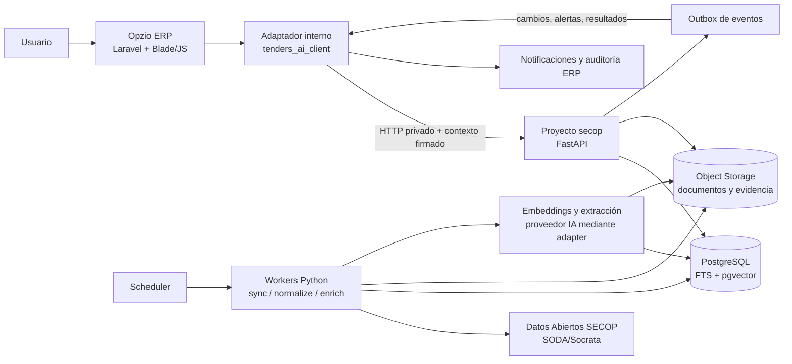

# Plan de accion v0.2 - Modulo Licitaciones SECOP dentro de Opzio ERP

**Estado:** Base implementada para refinamiento
**Producto:** Descubrimiento, priorizacion y seguimiento de oportunidades de contratacion publica
**Nombre visible en ERP:** Licitaciones
**Interfaz de usuario:** Opzio ERP (Laravel, patron administrativo existente)
**Motor de datos e IA:** Servicio privado Python
**Proyecto Python:** `opzio_microservices/secop`
**Principio rector:** Laravel coordina la experiencia y Python ejecuta el trabajo intensivo de datos, documentos e IA.

**Estado de implementación:** MVP funcional con fuentes SECOP reales, contexto OPZIO, documentos, evidencia, feedback, seguimiento y despliegue continuo preparado.

---

## 1. Decisión arquitectónica

La solución debe dividirse en dos productos con responsabilidades claras:

1. **Opzio ERP** es el control plane de usuario: autenticación, sesión, permisos, empresa activa, navegación, auditoría visible y experiencia de la pestaña `Discovery`.
2. **Proyecto `secop`** es el dominio de descubrimiento: fuentes SECOP, normalizacion, documentos, embeddings, matching, ranking, aprendizaje y jobs.

La comunicación se hace por una API HTTP privada y versionada. Ninguna aplicación escribe directamente en las tablas de la otra.

La palabra **microfunciones** se interpreta como funciones y jobs Python pequeños, idempotentes y sustituibles dentro de un mismo proyecto. En el MVP no se crean diez microservicios de red: se mantiene un servicio modular con varios entrypoints de ejecución. La separación física se activa cuando exista una razón operativa medible.

### Decisiones que reemplazan o precisan el plan anterior

| Tema | Decisión nueva | Razón |
| --- | --- | --- |
| Interfaz | El modulo `Licitaciones` y su pestaña `Discovery` viven dentro del ERP. | Evita duplicar login, permisos, empresa activa y navegación. |
| Python | API privada más workers independientes. | El feed no debe esperar sincronización, OCR o llamadas a un LLM. |
| Microservicios | Monolito modular Python al inicio; separación posterior por carga. | Reduce operación sin perder límites de dominio. |
| Datos | Base propia del servicio Python, preferiblemente PostgreSQL + pgvector. | Evita acoplamiento de esquemas y permite búsqueda vectorial. |
| IA | Adaptadores reemplazables para embeddings, extracción y reranking. | El producto no queda atado a un proveedor o modelo. |
| ERP-Python | Laravel actúa como BFF/adaptador para el navegador. | El navegador nunca conoce secretos ni el endpoint interno. |
| Tiempo de respuesta | Discovery lee matches ya calculados. | La operación es rápida y tolera que un job esté en curso. |
| Elegibilidad | El sistema muestra evidencia, riesgo y desconocidos; no declara habilitación legal automática. | La decisión final requiere revisión humana. |

### Lo que se conserva del plan de producto

- SECOP II como fuente principal y SECOP I como cobertura complementaria.
- Consulta incremental, paginación estable, upsert idempotente y versionado de cambios.
- Filtros duros antes de aplicar IA.
- Recuperación híbrida con búsqueda textual y embeddings.
- Separación entre compatibilidad comercial, elegibilidad y confianza de los datos.
- Evidencia citable, trazabilidad de modelo y revisión humana.
- Feedback explícito por empresa y aprendizaje progresivo.
- PostgreSQL/pgvector, almacenamiento de documentos y ejecución programada en GCP como ruta de producción.

---

## 2. Arquitectura objetivo



### Flujo de la pestaña Discovery del modulo Licitaciones

1. El usuario entra a `admin/tenders`.
2. Laravel ejecuta el middleware de sesión y permisos del ERP.
3. El controlador obtiene la empresa o tenant activo desde el contexto confiable del ERP.
4. `tenders_ai_client` solicita a Python el feed paginado para ese tenant.
5. Python devuelve matches almacenados, score desglosado, confianza, razones, riesgos y evidencia.
6. Laravel adapta la respuesta al contrato JSON que use el frontend actual.
7. Si el usuario pide actualizar, Laravel inicia un job Python y recibe `202 Accepted` con `job_id`; no bloquea la petición web.
8. Las acciones de guardar, descartar, interesarse o mover al pipeline se envían con `Idempotency-Key` y quedan auditadas.

El LLM no se ejecuta durante la carga normal del feed. El usuario puede ver la última versión válida y su fecha de cálculo mientras se procesa una actualización.

### Flujo de la pestaña Contexto

1. El usuario entra a `admin/tenders` y abre la pestaña `Contexto`.
2. El formulario se carga desde `tenders_contexts`, cuya fila inicial representa a OPZIO S.A.S.
3. El usuario actualiza razón social, NIT, descripción, servicios, tecnologías, sectores, cobertura, rango de valor y exclusiones.
4. Laravel normaliza las listas, incrementa la versión y conserva el actor que hizo el cambio.
5. Laravel sincroniza el perfil mediante `PUT /v1/profiles/{tenant_id}`.
6. Cada consulta posterior a Discovery vuelve a sincronizar el contexto antes de pedir resultados; así una reinicialización del proceso Python no deja el ranking sin perfil.

La vista pivote es `tenders.blade.php`; cada pestaña vive en un parcial de `resources/views/erp/tenders/`, actualmente `discovery.blade.php`, `context.blade.php` y `pipeline.blade.php` para `Discovery`, `Contexto` y `Seguimiento`.

---

## 3. Límites de responsabilidad

| Responsabilidad | ERP Laravel | Servicio Python |
| --- | --- | --- |
| Login, sesión y recuperación de acceso | Propietario | No implementa login de usuario en el MVP |
| Roles y permisos | Propietario | Valida el contexto recibido, no administra roles |
| Empresa/tenant activo | Propietario | Recibe un identificador firmado y aplica aislamiento |
| Pestaña `Discovery` | Propietario | No tiene frontend público |
| Catálogo externo SECOP | Referencia de integración | Propietario |
| Oportunidades normalizadas | Consulta/proyección opcional | Propietario |
| Documentos, texto, chunks y embeddings | Acceso mediante API | Propietario |
| Matching, score y explicación | Presenta | Propietario |
| Perfil de búsqueda | Formulario dentro del ERP | Guarda la versión de dominio y sus derivados |
| Feedback de oportunidad | Inicia la acción y muestra auditoría | Persiste la señal para aprender |
| Pipeline de licitación | Consume y presenta | Propietario del estado del dominio, salvo integración futura explícita |
| Notificaciones ERP | Propietario de canales y entrega | Emite eventos candidatos |
| Archivos y secretos | No guarda secretos de IA en el navegador | Secret Manager/Object Storage |
| Auditoría técnica de jobs | Panel de salud opcional | Propietario de `job_runs`, errores y reintentos |

La regla de propiedad es simple: **el ERP no consulta la base Python directamente y Python no consulta la base ERP directamente**. Toda sincronización pasa por contratos explícitos.

---

## 4. Identidad, tenancy y seguridad entre servicios

El ERP actual autentica al administrador mediante sesión y mantiene permisos en sesión. Además ya existe un patrón de endpoint interno protegido por loopback y token en `app/Http/Middleware/servers_token.php`. Para licitaciones se debe reutilizar la idea, con credenciales y permisos propios, sin compartir el token del agente de servidores.

### Contrato de contexto

Laravel debe construir un contexto interno con:

- `tenant_id`: identificador estable del negocio dentro del dominio de licitaciones;
- `actor_id`: usuario que ejecuta la acción;
- `permissions`: solo las capacidades necesarias para esa operación;
- `aud`: servicio Python esperado;
- `iat` y `exp`: emisión y expiración corta;
- `request_id`: trazabilidad de extremo a extremo.

Para una primera instalación en el mismo servidor puede usarse loopback más un secreto dedicado rotado. La ruta de producción recomendada es una de estas dos:

- GCP: URL privada, cuenta de servicio e identidad OIDC entre Cloud Run/Jobs y el ERP.
- Servidores propios: red privada más mTLS o token de servicio rotado y una envoltura de contexto firmada.

El navegador solo habla con Laravel. Nunca recibe el token, la URL privada, las credenciales de Socrata ni las claves de IA.

### Punto que debe resolverse antes de programar

El ERP existente no expone todavía un contexto universal de `company` como el CRM; usa sesión de usuario, permisos y entidades de clientes. Por ello hay que definir una tabla o adaptador explícito de correspondencia, por ejemplo:

- tenant de licitaciones;
- referencia estable al ERP (`unique_id` o UUID, no una relación implícita por número entero);
- NIT y nombre de la organización como datos de referencia;
- estado de sincronización;
- fecha de última actualización.

No se debe tomar cualquier `client_id` enviado por el navegador como tenant. El controlador debe resolverlo desde la sesión, membresía o contexto administrativo autorizado y Python debe rechazar un tenant que no esté presente en el contexto firmado.

### Controles mínimos

- Aislamiento por `tenant_id` en cada tabla de negocio Python; pruebas de acceso cruzado.
- Validación de permisos en Laravel antes de llamar a Python.
- Validación de audiencia, firma, expiración y tenant en Python.
- Timeouts cortos, límite de payload y `correlation_id` en todas las llamadas.
- Secretos en Secret Manager o en el gestor seguro del servidor; nunca en el repositorio.
- Allowlist de dominios de SECOP y protección SSRF al descargar URLs.
- Allowlist de tipos de archivo, límites de tamaño, hash, detección MIME real y bloqueo de ejecutables/macros.
- Procesamiento de documentos en un entorno con permisos mínimos y sin ejecutar contenido.
- Los documentos de contratación son datos no confiables: sus instrucciones no deben convertirse en instrucciones del agente o del sistema.
- Registro de fuente, versión del perfil, reglas, modelo, prompt, timestamp y evidencia usada.

---

## 5. Proyecto Python y microfunciones

Nombre del proyecto: `opzio_microservices/secop`.

```text
opzio_microservices/secop/
  app/
    domain/
      opportunities/
      profiles/
      matching/
      feedback/
      pipeline/
    application/
      commands/
      queries/
      ports/
    adapters/
      inbound/http/
      outbound/secop/
      outbound/database/
      outbound/storage/
      outbound/ai/
      outbound/erp/
    jobs/
      sync_secop.py
      normalize_opportunities.py
      fetch_documents.py
      extract_documents.py
      create_embeddings.py
      calculate_matches.py
      recheck_deadlines.py
      publish_alerts.py
      evaluate_ranker.py
    config/
    main.py
  migrations/
  tests/
    unit/
    integration/
    contract/
    fixtures/
  Dockerfile
  docker-compose.yml
  pyproject.toml
  README.md
```

### Reglas internas

- `domain` no importa FastAPI, SQLAlchemy, SDKs de Google/OpenAI ni Socrata.
- `application` define casos de uso y puertos; los adapters implementan infraestructura.
- Cada job acepta un rango o lote, puede reintentarse y registra `job_run`, cursor, contadores y error.
- Los jobs no dependen de memoria local para saber qué ya procesaron.
- Los prompts, reglas, pesos y modelos tienen versión.
- Toda salida de ranking guarda componentes y razones; no se persiste una explicación libre como única verdad.
- La API y los workers pueden compartir el paquete, pero sus procesos, límites de CPU/memoria y despliegues son independientes.
- No se incorpora un framework de agentes como dependencia central sin un caso de uso que lo justifique; el primer pipeline debe ser determinista y auditable.

### Microfunciones iniciales

| Microfunción | Entrada | Salida | Ejecución |
| --- | --- | --- | --- |
| `sync_secop` | Cursor y ventana de fecha | Registros crudos/versiones | Programada |
| `normalize_opportunities` | Registros crudos | Oportunidades normalizadas | Después de sync |
| `filter_candidates` | Oportunidades y reglas | Candidatos elegibles para análisis | Después de normalize |
| `create_embeddings` | Texto con hash nuevo | Vector versionado | Por lote |
| `fetch_documents` | Candidatos priorizados | Documentos almacenados | Por lote |
| `extract_documents` | Archivo validado | Requisitos y evidencia estructurada | Asíncrona |
| `calculate_matches` | Perfil + oportunidad + evidencia | Match explicable | Por tenant |
| `recheck_deadlines` | Oportunidades guardadas | Cambios y alertas | Cada 2 horas |
| `publish_alerts` | Eventos outbox | Eventos para ERP | Programada |
| `evaluate_ranker` | Feedback etiquetado | Métricas y modelo candidato | Bajo umbral |

---

## 6. Datos y propiedad de la información

La base Python debe ser separada de la base del ERP. En el MVP puede vivir en la misma instancia administrada para reducir costo, pero en otra base o esquema con usuario de base de datos propio. No se permiten joins entre tablas ERP y Python.

En la primera implementación, el formulario editable se persiste en la tabla ERP `tenders_contexts` para integrarse con la sesión y permisos existentes. Python recibe una proyección versionada por API y es responsable de utilizarla en el cálculo de Discovery; el contrato permite mover la persistencia a su propio repositorio sin cambiar la interfaz del ERP.

### Entidades mínimas

| Entidad | Propietario | Propósito |
| --- | --- | --- |
| `tenants` | Python, referenciada por ERP | Aislamiento del dominio y mapeo estable |
| `profile_versions` | Python | Perfil estructurado y consulta permanente |
| `capabilities` | Python | Capacidades, experiencia y evidencia verificable |
| `opportunities` | Python | Proceso SECOP normalizado |
| `opportunity_versions` | Python | Snapshots, adendas y cambios |
| `documents` | Python | Metadatos, hash, estado y origen |
| `document_chunks` | Python | Texto citable y embeddings versionados |
| `matches` | Python | Score, componentes, confianza y explicación |
| `feedback_events` | Python | Señales explícitas con actor y motivo |
| `pipeline_items` | Python | Etapa, responsable, fechas y resultado |
| `job_runs` | Python | Estado, cursor, contadores y errores |
| `model_versions` | Python | Modelo, prompt, reglas, métricas y estado |
| `outbox_events` | Python | Cambios pendientes de entregar al ERP |

Índices iniciales:

- `unique(source, source_id)` para deduplicar procesos;
- `tenant_id` en todas las entidades de negocio;
- B-tree para estado, fecha de cierre, última publicación y tenant;
- GIN para búsqueda textual y JSONB;
- pgvector para embeddings, con modelo y dimensión almacenados explícitamente;
- hash único por documento y versión de extracción.

El ERP puede mantener únicamente referencias locales para navegación, auditoría o integración posterior con contratos/proyectos. Esa proyección nunca sustituye la fuente Python.

---

## 7. Contrato API ERP-Python v1

La API solo es accesible por red privada. El prefijo lógico es `/v1`; el ERP puede exponer rutas web propias bajo `admin/tenders`.

| Método | Endpoint Python | Uso |
| --- | --- | --- |
| `GET` | `/v1/discovery` | Feed paginado de matches precomputados |
| `GET` | `/v1/opportunities/{id}` | Detalle, documentos, cambios y evidencia |
| `PUT` | `/v1/profiles/{tenant_id}` | Sincronizar el contexto versionado de la empresa |
| `POST` | `/v1/opportunities/{id}/feedback` | Guardar decisión y motivo |
| `POST` | `/v1/opportunities/{id}/pipeline` | Guardar, mover de etapa o asignar |
| `POST` | `/v1/jobs/discovery` | Solicitar sincronización o recálculo |
| `GET` | `/v1/jobs/{job_id}` | Consultar estado de job |
| `GET` | `/healthz` | Salud del proceso |
| `GET` | `/readyz` | Salud de dependencias necesarias |

`/v1/discovery` acepta `page`, `per_page`, `search`, `status`, `eligibility_state` y `data_confidence`. La respuesta devuelve `total`, `total_pages` y `next_cursor` dentro de `meta` para que el ERP pueda renderizar paginacion real.

Las rutas web del ERP que sirven como BFF son `GET /admin/tenders`, `POST /admin/tenders/discovery` y `POST /admin/tenders/context`. El navegador solo consume estas rutas Laravel; nunca llama directamente al servicio Python.

### Reglas del contrato

- El tenant y el actor vienen del contexto autenticado; no se aceptan como autoridad desde un formulario.
- Los endpoints mutables requieren `Idempotency-Key`.
- Los `GET` son reintentables; los `POST/PUT` solo se reintentan con clave de idempotencia.
- Las listas usan cursor estable, límite máximo y filtros explícitos.
- Las respuestas incluyen `request_id`, `generated_at`, `data`, `meta` y `error`.
- Los errores distinguen `validation_error`, `unauthorized`, `forbidden`, `not_found`, `dependency_unavailable`, `stale_data` y `job_in_progress`.
- El contrato se publica como OpenAPI y se prueba desde PHP con fixtures congelados.

### Respuesta mínima de una tarjeta

```json
{
  "opportunity_id": "secop2:abc-123",
  "title": "Servicio de desarrollo y mantenimiento de plataforma web",
  "entity": "Entidad contratante",
  "source": "secop2",
  "source_url": "https://...",
  "status": "open",
  "deadline": "2026-10-15T21:00:00Z",
  "amount": 250000000,
  "fit_score": 82,
  "eligibility_state": "requires_validation",
  "data_confidence": "high",
  "reasons": ["Coincide con desarrollo de software", "Valor dentro del rango"],
  "risks": ["Experiencia específica pendiente de validar"],
  "evidence": [{"document_id": "doc-1", "page": 4, "quote": "..."}],
  "model_version": "ranker-2026-09-01",
  "profile_version": 3,
  "calculated_at": "2026-09-03T12:00:00Z"
}
```

`fit_score`, `eligibility_state` y `data_confidence` son campos diferentes. Nunca se envía un único `qualified: true` que parezca una decisión jurídica.

---

## 8. Pipeline de descubrimiento y decisión

1. **Ingesta:** consultar SODA/Socrata con cursor y ventana de solapamiento.
2. **Normalización:** fechas, moneda, estados, modalidad, entidad, ubicación, UNSPSC y URLs.
3. **Filtro determinista:** excluir cerrados, incompatibles, fuera de rango o con tiempo insuficiente.
4. **Recuperación:** combinar PostgreSQL full-text search, UNSPSC y similitud vectorial.
5. **Score inicial:** calcular compatibilidad comercial, ajuste operativo y señales de experiencia.
6. **Selección documental:** descargar solo documentos de candidatos relevantes.
7. **Extracción estructurada:** obtener requisitos, fechas, experiencia, certificaciones, indicadores y riesgos con evidencia.
8. **Score de elegibilidad:** señalar `probably_fit`, `requires_validation`, `high_risk` o `unknown`; nunca inventar cumplimiento.
9. **Reordenamiento:** aplicar feedback explícito y modelo vigente del tenant.
10. **Publicación:** guardar match, razones, vacíos, evidencia, versión de perfil y versión de modelo.
11. **Alertas:** enviar cambios relevantes al outbox para que el ERP decida cómo notificar.

La IA generativa se usa para tareas acotadas y verificables: extracción, clasificación, resumen y explicación respaldada. No se usa para revisar todo el universo de SECOP ni para sustituir filtros, fechas o reglas de negocio.

### Aprendizaje

- Menos de 20 decisiones: solo preferencias explícitas y ajuste de centroides.
- A partir de un conjunto suficiente: entrenar un ranker simple por tenant y evaluarlo offline.
- `ignorado` no es feedback negativo.
- `no interesado` requiere motivo para mejorar la señal.
- Un modelo candidato no reemplaza al modelo activo sin mejorar `Precision@10`/`NDCG@10` y sin elevar falsos negativos críticos.
- Los datos de un tenant no se mezclan con otro sin consentimiento, anonimización y una decisión explícita.

---

## 9. Jobs, ejecución y escalamiento

### Primera forma de ejecución

- En desarrollo: Docker Compose y comandos Python reproducibles.
- En el servidor actual: API Python como servicio aislado en loopback; workers como procesos separados gestionados por systemd, Supervisor o el mecanismo existente.
- En GCP administrado: API en Cloud Run privado y trabajos finitos en Cloud Run Jobs, disparados por Cloud Scheduler.
- PostgreSQL y Object Storage deben estar en la misma región lógica que la API y los workers.

### Despliegue confirmado para el servidor actual

La documentación entregada del servidor confirma una VM Google Compute Engine con Debian 12, 2 vCPU, 7.8 GiB de RAM, 2 GiB de swap, 48 GiB libres en disco, MariaDB 10.11, NGINX, Supervisor y systemd. No se asume Docker en producción.

Por ese motivo el primer despliegue de `secop` usa:

- API FastAPI bajo usuario dedicado `opzio-secops`;
- producción en `127.0.0.1:9081`, ruta `/var/www/html/opzio_secops` y unidad `opzio-secops.service`;
- QA en `127.0.0.1:9082`, ruta `/var/www/html/opzio_secops_qa` y unidad `opzio-secops-qa.service`;
- un entorno virtual por release y enlace atomico `current`;
- `CPUQuota` y `MemoryMax` para no competir de forma ilimitada con PHP-FPM y MariaDB;
- acceso solo desde el ERP por loopback; no se agrega un dominio publico para Python.

Los workflows viven dentro del proyecto y replican el ciclo continuo del workspace en una forma adecuada para Python:

- `.github/workflows/main.yml` para la rama `main`;
- `.github/workflows/qa.yml` para la rama `qa`;
- pruebas y `ruff` antes de empaquetar;
- SSH, release versionada, venv, systemd y comprobacion de `/healthz` despues del despliegue.

Secretos requeridos en GitHub: `SSH_PRIVATE_KEY`, `SECOP_SERVICE_TOKEN` y `SECOP_QA_SERVICE_TOKEN`. El token del ERP (`OPZIO_TENDERS_AI_TOKEN`) se configura por separado en cada `.env` del ERP y debe coincidir con el servicio correspondiente.

No se debe ejecutar Python con `shell_exec`, `proc_open` o un proceso hijo desde cada request PHP. El ERP llama una API; la carga pesada vive en un proceso con límites y observabilidad propios.

### Frecuencias iniciales

| Job | Frecuencia | Regla |
| --- | --- | --- |
| `sync_secop` | Cada 30 minutos | Solo nuevos/modificados, con solapamiento |
| `normalize_opportunities` | Después de cada sync | Reanudable e idempotente |
| `calculate_matches` | Después de enriquecer | Por tenant con perfil activo |
| `fetch/extract_documents` | Solo candidatos priorizados | Límite de costo y tamaño |
| `recheck_deadlines` | Cada 2 horas | Más frecuente bajo 72 horas |
| `publish_alerts` | Cada pocos minutos | Outbox con reintentos |
| `evaluate_ranker` | Semanal o por umbral | Nunca despliega automáticamente sin evaluación |

### Cuándo separar físicamente componentes

- Un job supera de forma recurrente su ventana operativa.
- El procesamiento documental consume recursos del API.
- Se necesita un SLA diferente para lectura, ingesta o documentos.
- El volumen requiere paralelizar por tenant o por lote.
- El outbox acumula eventos o necesita entrega garantizada.

La primera evolución razonable es separar `document-worker` y `ranking-worker`, no crear un servicio por cada función matemática.

---

## 10. Observabilidad y confiabilidad

Cada request y job debe tener `request_id`, `tenant_id` y versión de código. Las métricas iniciales son:

- última sincronización exitosa y freshness de SECOP;
- filas recibidas, aceptadas, rechazadas y duplicadas;
- porcentaje de documentos descargados, extraídos y fallidos;
- profundidad y antigüedad del outbox;
- latencia p50/p95 de `GET /v1/discovery`;
- tiempo de cada job y número de reintentos;
- costo estimado por extracción, embedding y tenant;
- cobertura de evidencia en los matches;
- `Precision@10`, `NDCG@10`, tasa de interesado y falsos negativos críticos.

El feed debe tener un comportamiento degradado: si Python está temporalmente no disponible, Laravel muestra un error controlado o la última respuesta cacheada con su timestamp; nunca presenta datos antiguos como si fueran actuales.

Los estados mínimos de job son `queued`, `running`, `succeeded`, `partial`, `failed` y `cancelled`. Los fallos permanentes quedan visibles para reprocesamiento manual.

---

## 11. Plan de implementación

### Fase 0 - Decisiones y datos de referencia

**Entregables:** tenant inicial, permisos, perfil de OPZIO, restricciones duras, rango de valor, cobertura geográfica, 20-30 procesos históricos etiquetados y contrato API aprobado.

**Salida:** se puede explicar qué significa una buena oportunidad antes de entrenar o automatizar.

### Fase 1 - Fundaciones Python

**Entregables:** repositorio, FastAPI, Pydantic, configuración, OpenAPI, persistencia SQLite/MariaDB, health checks, logging, Docker y pruebas unitarias/contractuales.

**Salida:** servicio privado probado localmente y conectado a datos SECOP reales en una base aislada.

### Fase 2 - Puente ERP-Python

**Entregables:** `tenders_ai_client` y `tenders_context_service` en Laravel, configuración del servicio, permiso `Licitaciones`, rutas administrativas, entrada del sidebar, vista pivote con parciales `discovery` y `context`, assets Vite y estados de carga/error.

**Salida:** la pestaña `Discovery` consulta el API Python con datos persistidos, sin exponer el servicio al navegador ni sembrar fixtures en producción.

### Fase 3 - Ingesta y catálogo SECOP

**Entregables:** conectores SECOP II/I, cursor, recheck reciente, backoff, upsert, snapshots, panel de salud, límites y dead-letter lógico.

**Salida:** una ejecución repetida no duplica procesos; las pruebas y corridas reales verifican contadores, cursor y versiones.

### Fase 4 - Discovery sin documentos profundos

**Entregables:** perfil versionado, filtros duros, full-text search, embeddings, matching inicial, feed, detalle, score desglosado y confianza separada.

**Salida:** el equipo puede encontrar y priorizar oportunidades usando datos públicos básicos.

### Fase 5 - Evidencia documental

**Entregables:** descarga selectiva, almacenamiento, extracción PDF/DOCX/XLSX, páginas/hojas citables, requisitos, riesgos y manejo de documentos no procesables.

**Salida:** los hallazgos relevantes muestran fuente y ubicación o quedan como `unknown`.

### Fase 6 - Feedback, pipeline y alertas

**Entregables:** interesado/no interesado con motivos, guardado, etapas, responsables, outbox, cambios de adenda, vencimientos y notificaciones integradas con ERP.

**Salida:** el usuario trabaja el proceso de principio a fin desde ERP y sus decisiones alimentan el ranking.

### Fase 7 - Producción controlada

**Entregables:** secretos, backups/PITR, alertas, pruebas E2E, aislamiento tenant, límites de costo, runbook, rollback y revisión comercial/jurídica.

**Salida:** operación con un tenant piloto y criterios de go-live medidos.

La primera versión útil debe priorizar un feed confiable y explicable. El reentrenamiento avanzado y la automatización de aplicación se dejan después de conseguir suficientes señales reales.

### Ejecución real ya disponible

Desde `opzio_microservices/secop` se puede sincronizar una ventana controlada con:

```powershell
.\.venv\Scripts\python.exe -m app.jobs.sync_secop --source all --lookback-days 7 --page-size 250 --max-pages 20
```

La repetición es idempotente. En producción, los timers systemd ejecutan el mismo worker sin depender de una petición del ERP; la pestaña `Discovery` solo sincroniza el contexto vigente antes de leer el feed.

---

## 12. Criterios de aceptación del MVP

- Discovery carga resultados precalculados sin llamar a un LLM por cada tarjeta.
- Un usuario no puede consultar ni modificar datos de otro tenant.
- Cada resultado tiene fuente, fecha de consulta, estado, score de compatibilidad, estado de elegibilidad, confianza y razones.
- Un requisito sin evidencia permanece como desconocido o pendiente, nunca como cumplido.
- Una sincronización repetida es idempotente.
- Una adenda o cambio relevante crea versión, recalcula y puede generar alerta.
- Un documento corrupto, malicioso o no soportado no detiene todo el lote.
- Las acciones del usuario tienen actor, timestamp, motivo y `Idempotency-Key`.
- El feedback explícito aparece en la siguiente actualización de ranking sin mezclar tenants.
- Python puede operar sus jobs aunque se despliegue Laravel, y Laravel puede mostrar el último resultado válido aunque un job esté procesando.
- Existen health checks, métricas de freshness, errores visibles y procedimiento de reintento.
- Ninguna pantalla o API afirma automáticamente que la empresa está habilitada legalmente para contratar.

---

## 13. Decisiones que deben cerrarse en el siguiente refinamiento

1. **Tenant inicial:** iniciar solo con OPZIO o soportar desde el primer día varias empresas del ERP. Recomendación: diseñar multi-tenant y activar un solo tenant piloto.
2. **Ubicación de despliegue:** mismo host privado, VM separada o Cloud Run privado. Recomendación: API privada y workers aislados; decidir según recursos del servidor.
3. **PostgreSQL:** confirmar si se contratará una instancia separada de la base actual del ERP y el almacenamiento de documentos.
4. **Identidad de organización:** definir la entidad ERP que representa al participante y su clave estable.
5. **Permisos:** separar ver Discovery, editar perfil, dar feedback, administrar fuentes y mover al pipeline.
6. **Proveedor de IA:** medir costo, latencia y calidad de Vertex/OpenAI detrás del mismo adapter.
7. **Fuentes iniciales:** confirmar campos y límites actuales de SECOP II/I antes de fijar el esquema de normalización.
8. **Política de documentos:** tamaño máximo, formatos, retención y revisión de seguridad.
9. **Alertas:** correo, WhatsApp, notificación interna y frecuencia aceptable.
10. **Criterio comercial:** qué motivos convierten una oportunidad en descartada, pendiente o prioritaria.

---

## 14. Listado ejecutivo

1. Mantener la pestaña `Discovery` dentro de Opzio ERP.
2. Crear y mantener `opzio_microservices/secop` como proyecto Python privado con FastAPI.
3. Usar microfunciones Python y workers separados, pero un solo proyecto modular en el MVP.
4. Mantener la base Python separada de la base Laravel; PostgreSQL + pgvector es la opción recomendada.
5. Hacer que Laravel sea el BFF del módulo `Licitaciones`: autentica, autoriza, firma el contexto y adapta la respuesta al frontend.
6. Hacer que Python sea dueño de SECOP, documentos, embeddings, matching, ranking y procesamiento asíncrono.
7. Hacer que Discovery consulte matches precalculados, no ejecuciones de IA en tiempo real.
8. Aplicar filtros deterministas antes de embeddings y reservar el LLM para candidatos y documentos relevantes.
9. Mostrar por separado compatibilidad, elegibilidad y confianza, siempre con evidencia y desconocidos explícitos.
10. Versionar oportunidades, perfil, prompts, reglas, modelos, documentos y feedback.
11. Implementar idempotencia, outbox, reintentos, dead-letter lógico y observabilidad desde el inicio.
12. Proteger la integración con red privada, credencial de servicio, contexto firmado, aislamiento tenant y control de documentos.
13. Lanzar primero un tenant piloto con 20-30 procesos históricos etiquetados.
14. Separar físicamente nuevos servicios solo cuando el volumen, latencia o SLA lo justifique.
15. Refinar primero el contrato ERP-Python, el modelo de tenant y los criterios de relevancia antes de ampliar la UI de `Licitaciones`.
