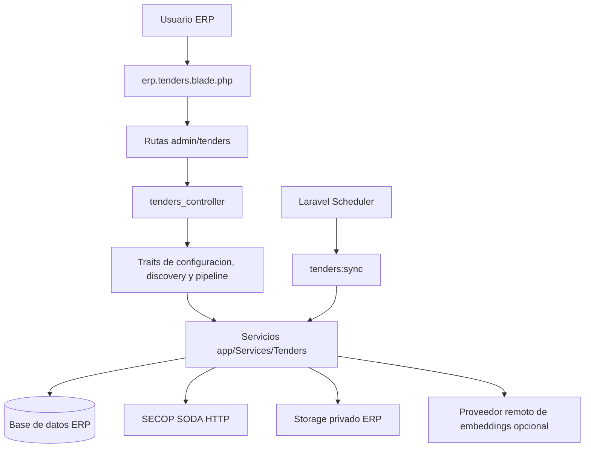

# Plan vivo de migracion de Licitaciones al Opzio ERP

**Estado:** Fases 1-6 implementadas; corte productivo pendiente
**Version:** 0.2
**Fecha de inicio:** 2026-09-19
**Producto:** Modulo Licitaciones dentro de `opzio_erp`
**Fuente de referencia estructural:** modulo Jira de `opzio_erp`
**Objetivo:** retirar la logica de ejecucion del proyecto Python y consolidarla en la aplicacion Laravel, conservando el comportamiento funcional y la sintaxis del ERP.

> Este es un documento de trabajo vivo. Cada iteracion debe actualizar el estado, los archivos afectados, las pruebas ejecutadas, las decisiones tomadas y el siguiente paso. El modulo se considera terminado solo cuando cumple los criterios de la seccion 16.

### Estado ejecutado el 2026-09-19

El ERP ya contiene la base funcional local de Licitaciones: configuracion SECOP cifrada, cliente SODA, normalizacion SECOP I/II, sincronizacion incremental, oportunidades versionadas, Discovery, feedback, pipeline, documentos privados, embeddings opcionales, importador JSONL y comando programable. Las pruebas Feature de Tenders pasan con 11 pruebas y 56 aserciones. El corte de datos reales no se ejecuta automaticamente porque la base Python contiene 19,168 oportunidades y requiere backup, ventana operativa y validacion de la base destino.

---

## 1. Reglas de arquitectura acordadas

Estas reglas son parte del alcance y no deben cambiarse durante la implementacion sin registrar una decision en la seccion 17.

1. Toda la logica de Licitaciones vivira dentro de `opzio_erp`.
2. La base de datos de oportunidades, documentos, sincronizaciones, feedback, pipeline y configuracion sera la misma base configurada por el ERP.
3. No existira una API HTTP interna entre Laravel y Python para el funcionamiento normal del modulo.
4. El proyecto `opzio_uservices_secop` dejara de ser dependencia de runtime despues de completar la migracion y el corte.
5. No se creara un nuevo microservicio ni una nueva arquitectura de dominios alejada de las convenciones actuales del ERP.
6. No se dividiran workers por producto o por microservicio. La sincronizacion sera un comando Artisan del ERP reutilizable desde la interfaz y el scheduler existente.
7. Las operaciones manuales largas usaran lotes y cursores como el modulo Jira; la interfaz mostrara progreso y continuara los lotes sin mantener una peticion HTTP larga.
8. Se conservaran las rutas publicas del navegador bajo `/admin/tenders` cuando sea razonable para evitar una migracion innecesaria del frontend.
9. Se conservara el estilo de nombres legacy del ERP: clases y archivos de modulo en `snake_case`, modelos Eloquent en `snake_case`, servicios bajo `app/Services/Tenders` y traits bajo `app/traits`.
10. Los controladores orquestan; los servicios contienen integraciones, sincronizacion, normalizacion, filtros y calculos.
11. Los secretos no se guardan en el navegador, en vistas ni en texto plano de la base de datos.
12. El contexto de empresa sigue siendo el perfil comercial; la configuracion tecnica de SECOP y los filtros duros se administran desde una pestaña separada de Configuracion.
13. La migracion no afirma habilitacion legal automatica para contratar. El resultado solo expresa compatibilidad, confianza, estado y pendientes de validacion.

### 1.1 Lo que no se hara en esta migracion

- No se creara `app/Domain/Tenders` en la primera implementacion.
- No se introducira una base PostgreSQL, un vector database o un sistema de colas nuevo como requisito de la migracion.
- No se ejecutara sincronizacion SECOP, descarga documental ni calculo de Discovery dentro de un controlador web completo.
- No se conservara `tenders_ai_client` como dependencia funcional una vez terminado el corte.
- No se mezclaran tablas de Licitaciones con las tablas de Jira, Servidores o CRM.
- No se reescribira el layout global del ERP.
- No se hara una refactorizacion general de los modulos legacy no relacionados.

---

## 2. Estado verificado antes de iniciar

### 2.1 Python actual

El servicio Python contiene actualmente:

- cliente HTTP para SECOP I y SECOP II;
- paginacion incremental por fecha e identificador;
- normalizacion de fechas, valores, estados, entidades, ubicaciones y categorias;
- upsert idempotente y versionado de payloads;
- contexto comercial de la empresa;
- filtros por rango de valor y terminos excluidos;
- ranking por reglas, texto, feedback y similitud coseno opcional;
- documentos, descarga con allowlist, hash, chunks y extraccion basica;
- embeddings remotos opcionales;
- feedback, pipeline, outbox y ejecuciones de sincronizacion.

Archivos de referencia:

- [app/main.py](../../opzio_microservices/opzio_uservices_secop/app/main.py)
- [app/secop_client.py](../../opzio_microservices/opzio_uservices_secop/app/secop_client.py)
- [app/normalization.py](../../opzio_microservices/opzio_uservices_secop/app/normalization.py)
- [app/sync_service.py](../../opzio_microservices/opzio_uservices_secop/app/sync_service.py)
- [app/repository.py](../../opzio_microservices/opzio_uservices_secop/app/repository.py)
- [app/document_processing.py](../../opzio_microservices/opzio_uservices_secop/app/document_processing.py)
- [app/embeddings.py](../../opzio_microservices/opzio_uservices_secop/app/embeddings.py)
- [app/models.py](../../opzio_microservices/opzio_uservices_secop/app/models.py)
- [app/schemas.py](../../opzio_microservices/opzio_uservices_secop/app/schemas.py)

El plan Python menciona componentes futuros de extraccion avanzada, reranking y aprendizaje. La migracion debe distinguir lo implementado de lo planificado. En la primera version se migra el comportamiento existente, no se inventan componentes que aun no tienen contrato ni pruebas.

### 2.2 ERP actual

Licitaciones ya tiene:

- pagina raiz `resources/views/erp/tenders.blade.php`;
- pestañas de Discovery, Contexto y Oportunidad;
- controlador `tenders_controller`;
- `tenders_context_service` y tabla `tenders_contexts`;
- cliente HTTP heredado hacia Python, retirado durante esta migracion;
- rutas administrativas bajo `admin_middleware`;
- frontend dividido en `tenders.js`, `context.js` y `pipeline.js`;
- estilos en `resources/sass/erp/tenders/tenders.scss`.

Archivos de referencia:

- [tenders_controller.php](../app/Http/Controllers/tenders_controller.php)
- [tenders_context_service.php](../app/Services/Tenders/tenders_context_service.php)
- [tenders.blade.php](../resources/views/erp/tenders.blade.php)
- [context.blade.php](../resources/views/erp/tenders/context.blade.php)
- [tenders_context.php](../app/Models/tenders_context.php)
- [web.php](../routes/web.php)

### 2.3 Patron Jira que se adopta

El modulo Jira ya demuestra dentro del mismo ERP las decisiones que necesitamos:

- controlador pequeno con respuestas JSON uniformes;
- traits por pestaña o superficie funcional;
- servicios especializados bajo `app/Services/Jira`;
- modelos Eloquent con relaciones y casts;
- migraciones con tablas separadas por responsabilidad;
- credenciales cifradas mediante `encrypted:array`;
- configuracion tecnica en una columna JSON;
- comando Artisan de sincronizacion;
- ejecucion programada desde `app/Console/Kernel.php`;
- vista raiz con tabs, parciales Blade, entrypoint JS y Sass propio;
- sincronizacion manual por lotes con progreso en frontend.

Referencias verificadas:

- [jira_controller.php](../app/Http/Controllers/jira_controller.php)
- [jira_configuration_trait.php](../app/traits/jira_configuration_trait.php)
- [jira_client.php](../app/Services/Jira/jira_client.php)
- [jira_sync_service.php](../app/Services/Jira/jira_sync_service.php)
- [jira_connection.php](../app/Models/jira_connection.php)
- [create_jira_module_tables.php](../database/migrations/2026_09_08_000001_create_jira_module_tables.php)
- [configuration.blade.php](../resources/views/erp/jira/configuration.blade.php)
- [configuration.js](../resources/js/erp/jira/configuration.js)
- [PLAN_MODULO_JIRA_ERP.md](PLAN_MODULO_JIRA_ERP.md)

### 2.4 Validacion inicial

Antes de iniciar la migracion se verifico el estado de referencia:

- pruebas Python: 47 pruebas aprobadas;
- `ruff check app tests`: aprobado;
- rutas Laravel de Licitaciones: 13 rutas registradas;
- `php artisan about`: aprobado.

Esto valida la base actual, pero no sustituye las pruebas de paridad, carga y migracion que se definen mas adelante.

---

## 3. Resultado objetivo



El navegador solo habla con Laravel. Los servicios Laravel consultan y actualizan la base del ERP, llaman directamente a SECOP cuando corresponde y persisten una proyeccion local para que Discovery no dependa de una llamada externa por tarjeta.

### 3.1 Separacion funcional interna

| Superficie | Responsabilidad | Patron ERP |
| --- | --- | --- |
| Configuracion | Conexion SECOP, fuentes, limites tecnicos y filtros duros | Trait + servicio + formulario Blade |
| Contexto | Perfil comercial de OPZIO y criterios de compatibilidad | Servicio existente evolucionado |
| Discovery | Consulta, filtros, score, razones, riesgos y evidencia | Servicio de consulta + rutas JSON |
| Seguimiento | Feedback, guardado, etapas e historial | Servicio/repositorio Eloquent |
| Sincronizacion | SECOP, cursores, versiones y estado de ejecucion | `tenders_sync_service` + Artisan |
| Documentos | Descarga segura, metadatos, texto y evidencia | `tenders_document_service` |
| Embeddings | Solicitud opcional y persistencia del vector | `tenders_embedding_service` |

---

## 4. Estructura de archivos objetivo

La estructura debe seguir el modulo Jira y los nombres ya existentes, sin introducir una arquitectura paralela.

### 4.1 Aplicacion PHP

```text
app/
  Console/
    Commands/
      tenders_sync.php
      tenders_import_python.php       # temporal para la migracion de datos
  Http/
    Controllers/
      tenders_controller.php
  Models/
    tenders_connection.php
    tenders_sync_run.php
    tenders_opportunity.php
    tenders_opportunity_version.php
    tenders_document.php
    tenders_document_chunk.php
    tenders_feedback_event.php
    tenders_pipeline_item.php
    tenders_pipeline_entry.php
    tenders_outbox_event.php
  Services/
    Tenders/
      tenders_configuration_service.php
      tenders_secop_client.php
      tenders_normalization_service.php
      tenders_sync_service.php
      tenders_discovery_service.php
      tenders_document_service.php
      tenders_embedding_service.php
      tenders_pipeline_service.php
  traits/
    tenders_configuration_trait.php
    tenders_discovery_trait.php
    tenders_pipeline_trait.php
```

Reglas de responsabilidad:

- `tenders_controller`: pagina, inyeccion de servicios, respuestas y delegacion.
- `tenders_configuration_trait`: autorizacion, validacion y payload de Configuracion.
- `tenders_discovery_trait`: validacion de filtros y respuestas de Discovery.
- `tenders_pipeline_trait`: feedback, guardado y operaciones de seguimiento.
- `tenders_secop_client`: exclusivamente HTTP externo, retries, timeout y JSON.
- `tenders_normalization_service`: transformacion de filas SECOP a arrays normalizados.
- `tenders_sync_service`: cursor, upsert, versiones, estadisticas y ejecuciones.
- `tenders_discovery_service`: filtros, score, razones, riesgos y paginacion local.
- `tenders_document_service`: allowlist, descarga, hash, almacenamiento y extraccion.
- `tenders_embedding_service`: adapter HTTP opcional y control de modelo/dimension.
- Los servicios no deben leer `Request` ni acceder directamente a `session()`.

### 4.2 Vistas y frontend

```text
resources/views/erp/
  tenders.blade.php
  tenders/
    discovery.blade.php
    context.blade.php
    pipeline.blade.php
    configuration.blade.php
    partials/
      configuration_connection.blade.php
      configuration_filters.blade.php
      configuration_status.blade.php

resources/js/erp/tenders/
  tenders.js
  api.js
  configuration.js
  context.js
  discovery.js
  pipeline.js
  state.js

resources/sass/erp/tenders/
  tenders.scss
```

La primera iteracion puede conservar funciones de `tenders.js` y extraerlas progresivamente. No se debe reescribir el Discovery visual mientras se migra el backend salvo que una respuesta cambie de forma.

### 4.3 Configuracion de modulo

Crear `config/tenders.php` para valores tecnicos por defecto, siguiendo `config/jira.php`:

```php
return [
    'default_timezone' => env('TENDERS_TIMEZONE', 'America/Bogota'),
    'timeout' => (float) env('TENDERS_TIMEOUT', 30),
    'retries' => (int) env('TENDERS_RETRIES', 2),
    'test_timeout' => (float) env('TENDERS_TEST_TIMEOUT', 10),
    'web_batch_size' => (int) env('TENDERS_WEB_BATCH_SIZE', 25),
    'max_page_size' => (int) env('TENDERS_MAX_PAGE_SIZE', 250),
    'max_rows_per_sync' => (int) env('TENDERS_MAX_ROWS_PER_SYNC', 5000),
    'document_max_bytes' => (int) env('TENDERS_DOCUMENT_MAX_BYTES', 25000000),
];
```

Los valores editables por el usuario se guardan en la tabla `tenders_connections.settings`. `.env` solo contiene defaults operativos y no el token de SECOP si el usuario lo administra desde Configuracion.

---

## 5. Modelo de datos en la base ERP

Todas las tablas se crean mediante migraciones Laravel en la base configurada por `DB_CONNECTION`, `DB_DATABASE` y sus credenciales actuales. No se consulta directamente la base SQLite/MariaDB del proyecto Python.

### 5.1 Conexion y configuracion

Tabla propuesta: `tenders_connections`.

Debe seguir la forma de `jira_connections`:

| Campo | Uso |
| --- | --- |
| `id` | Identificador local |
| `singleton_key` | Valor unico `1`; el ERP inicia con una conexion SECOP global |
| `name` | Nombre visible de la conexion |
| `provider` | `secop_soda` |
| `status` | `draft`, `active`, `error`, `disabled` |
| `credentials` | `encrypted:array`; app token opcional de Socrata y secretos futuros |
| `settings` | JSON con fuentes, datasets, timeout, paginacion y filtros |
| `last_tested_at` | Ultima prueba de conexion |
| `last_sync_at` | Ultima sincronizacion exitosa |
| `last_error` | Error sanitizado visible para administradores |
| `created_by_user_id` | Actor que creo la conexion |
| timestamps/soft deletes | Convencion Jira |

La migracion debe impedir mas de una conexion mientras el ERP no tenga un selector de empresa activo, usando el mismo patron de `singleton_key` de Jira.

El token debe conservarse si el campo llega vacio en una edicion, igual que `jira_configuration_trait`. Nunca debe regresar en un payload de vista o respuesta JSON.

### 5.2 `settings` de la conexion

El JSON debe tener una forma versionada y validada por servicio. Propuesta inicial:

```json
{
  "schema_version": 1,
  "timezone": "America/Bogota",
  "base_url": "https://www.datos.gov.co/resource",
  "sources": {
    "secop1": {
      "enabled": true,
      "dataset_id": "f789-7hwg",
      "timestamp_field": "ultima_actualizacion",
      "id_field": "uid"
    },
    "secop2": {
      "enabled": true,
      "dataset_id": "p6dx-8zbt",
      "timestamp_field": "fecha_de_ultima_publicaci",
      "id_field": "id_del_proceso"
    }
  },
  "transport": {
    "timeout": 30,
    "retries": 3,
    "page_size": 250,
    "max_pages": 20,
    "lookback_days": 7,
    "recheck_days": 2
  },
  "filters": {
    "only_postulable": true,
    "min_days_to_deadline": 0,
    "statuses": [],
    "departments": [],
    "cities": [],
    "procurement_methods": [],
    "contract_types": [],
    "category_codes": [],
    "excluded_terms": [],
    "min_contract_value": null,
    "max_contract_value": null
  },
  "documents": {
    "enabled": true,
    "limit_per_opportunity": 20,
    "max_bytes": 25000000,
    "allowed_extensions": ["pdf", "docx", "xlsx", "txt", "csv"]
  },
  "embeddings": {
    "enabled": false,
    "provider": "openai",
    "model": "text-embedding-3-small",
    "dimensions": 1536
  }
}
```

El formulario no debe permitir editar libremente JSON. Los campos se presentan por secciones y el servicio compone el JSON despues de validar cada valor.

### 5.3 Contexto comercial existente

Se conserva `tenders_contexts` para:

- razon social y NIT;
- descripcion, mision y vision;
- servicios y soluciones;
- tecnologias, capacidades y metodologia;
- sectores y tipos de organizacion;
- cobertura geografica.

Los campos `min_contract_value`, `max_contract_value` y `excluded_terms` ya existen en `tenders_contexts`. Para evitar dos fuentes de verdad:

1. Fase 1: leerlos como fallback por compatibilidad.
2. Fase 2: copiar sus valores al bloque `settings.filters` de `tenders_connections`.
3. Fase 2: la pestaña Configuracion pasa a ser la fuente de escritura de filtros duros.
4. Fase 3: `tenders_context_service` deja de enviar filtros tecnicos al perfil de compatibilidad.
5. Fase 7: decidir si se eliminan esos campos o se mantienen nullable para compatibilidad historica.

La pestaña Contexto no debe duplicar controles de Configuracion despues del corte.

### 5.4 Catalogo de oportunidades

Tabla `tenders_opportunities`:

- `source`, `source_id`, `source_process_id` y `reference`;
- titulo, descripcion, entidad, NIT, departamento y ciudad;
- monto, moneda, modalidad, tipo de contrato y categoria;
- estado normalizado y estados originales SECOP;
- URL de fuente y fechas de publicacion/actualizacion/cierre;
- `payload_hash` para idempotencia;
- `raw_payload` JSON para trazabilidad;
- `embedding`, `embedding_model` y `embedding_hash` JSON/campos iniciales;
- timestamps.

Indices obligatorios:

- unique `source + source_id`;
- `status + deadline_at`;
- `source + last_published_at`;
- `source_process_id`;
- campos usados por filtros y busqueda.

La tabla no tendra `tenant_id` en esta primera version porque el catalogo SECOP es global en el ERP actual. El score, feedback y pipeline si deben quedar asociados al contexto/tenant definido por la configuracion actual (`opzio`). Esta decision debe revisarse antes de habilitar multiples empresas.

### 5.5 Versiones y ejecuciones

Tabla `tenders_opportunity_versions`:

- oportunidad relacionada;
- `payload_hash`;
- `changed_fields` JSON;
- `raw_payload` JSON;
- `observed_at`.

Tabla `tenders_sync_runs`:

- conexion;
- fuente;
- modo `manual`, `incremental`, `full`, `documents`, `embeddings`;
- estado `running`, `succeeded`, `partial`, `failed`, `cancelled`;
- cursor de fecha e identificador;
- parametros JSON;
- contadores de paginas, filas vistas, creadas, actualizadas, sin cambios y rechazadas;
- error sanitizado;
- `started_at`, `finished_at`.

### 5.6 Documentos y evidencia

Tablas:

- `tenders_documents` para metadatos, URL, extension, tamaño, MIME, hash, estado y ruta de storage;
- `tenders_document_chunks` para texto, pagina/hoja, indice y hash del chunk.

El archivo debe vivir en un disk privado configurado en `config/filesystems.php`, no en una ruta publica. La base solo guarda el path, nunca la expectativa de que el navegador pueda leer directamente el archivo.

### 5.7 Feedback, pipeline y outbox

Tablas:

- `tenders_feedback_events` con actor, evento, motivo, notas y `idempotency_key`;
- `tenders_pipeline_items` para el estado actual;
- `tenders_pipeline_entries` para el historial y borrado logico;
- `tenders_outbox_events` para auditoria y futuras notificaciones.

Las operaciones mutables conservan la idempotencia existente del contrato Python, aunque ya no exista la llamada HTTP.

---

## 6. Mapeo de Python a Laravel

| Python actual | Implementacion ERP | Criterio de homologacion |
| --- | --- | --- |
| `app/main.py` | `tenders_controller` + `routes/web.php` | Respuestas JSON del ERP y `admin_middleware` |
| `app/settings.py` | `config/tenders.php` + `tenders_connections.settings` | Defaults en config, valores administrables en DB |
| `app/secop_client.py` | `tenders_secop_client` | `Http`, `retry`, `timeout`, `acceptJson`, mensajes sanitizados |
| `app/normalization.py` | `tenders_normalization_service` | Funciones pequenas, arrays normalizados y pruebas Unit |
| `app/sync_service.py` | `tenders_sync_service` | Cursor, paginas, hash, upsert y `tenders_sync_runs` |
| `app/repository.py` | Modelos Eloquent + `tenders_discovery_service` | Query Builder/Eloquent; no cargar todo sin limite |
| `app/document_processing.py` | `tenders_document_service` | Storage ERP, allowlist, hash, chunks y estados |
| `app/embeddings.py` | `tenders_embedding_service` | Adapter HTTP configurable; provider opcional |
| `app/models.py` | Modelos `tenders_*` + migraciones | Relaciones y casts existentes del ERP |
| `app/schemas.py` | Validaciones en traits/Form Requests y payloads | Contratos JSON preservados |
| `app/jobs/sync_secop.py` | `app/Console/Commands/tenders_sync.php` | Un solo comando con modos y opciones |
| `app/jobs/process_documents.py` | Fase interna del mismo `tenders_sync_service` | Sin worker separado |
| `app/jobs/create_embeddings.py` | Fase opcional del mismo comando | Solo textos nuevos o modificados |
| `tenders_ai_client.php` | Se elimina despues del corte | No queda salto HTTP ERP-Python |

---

## 7. Configuracion del modulo

La pestaña nueva se llamara **Configuracion** y se agregara a [tenders.blade.php](../resources/views/erp/tenders.blade.php), siguiendo la composicion de [jira.blade.php](../resources/views/erp/jira.blade.php).

### 7.1 Seccion Conexion SECOP

Campos visibles:

- nombre interno;
- fuentes activas: SECOP I y SECOP II;
- token de aplicacion Socrata, con input password y conservacion si queda vacio;
- estado de conexion;
- ultima prueba;
- ultima sincronizacion;
- ultimo error;
- timeout y reintentos;
- tamaño de pagina;
- dias de ventana incremental;
- limite maximo de paginas.

Campos avanzados, solo si se justifican en la validacion:

- dataset ID de SECOP I;
- dataset ID de SECOP II;
- nombres de campos de cursor;
- URL base permitida.

La URL base no debe ser un campo libre sin allowlist. El servicio debe rechazar dominios que no sean los aprobados para SECOP.

Acciones:

- Guardar conexion;
- Probar conexion;
- Sincronizar ahora;
- Ver estado de sincronizacion.

### 7.2 Seccion Criterios de filtrado

Los filtros se dividen en **filtros duros** y **criterios de compatibilidad** para no confundir una exclusion comercial con una decision juridica.

Filtros duros iniciales:

- solo procesos postulables;
- fuentes activas;
- estado de proceso;
- valor minimo y maximo;
- dias minimos antes del cierre;
- departamentos y ciudades;
- modalidades de contratacion;
- tipos de contrato;
- codigos o familias UNSPSC;
- terminos excluidos;
- limite de documentos por oportunidad;
- documentos habilitados/deshabilitados.

Criterios de compatibilidad permanecen en Contexto:

- servicios;
- tecnologias y capacidades;
- sectores;
- cobertura geografica;
- descripcion de la empresa;
- feedback historico.

La interfaz debe mostrar la version del filtro y el usuario que lo modifico. Cada guardado debe aumentar `settings.filters_version` o una version equivalente persistida.

### 7.3 Respuestas del frontend

Las respuestas deben seguir el estilo Jira:

```json
{
  "status": 1,
  "message": "Operacion completada.",
  "data": {},
  "meta": {}
}
```

Los errores deben devolver `status: 0`, mensaje apto para usuario y `errors` de validacion cuando corresponda. Nunca se devuelve `credentials`, token ni el payload completo de secretos.

---

## 8. Rutas y controlador objetivo

Las rutas existentes de Discovery, Contexto, Pipeline y oportunidades se conservan durante la migracion. Se agregan rutas de configuracion siguiendo Jira:

| Metodo | Ruta | Accion |
| --- | --- | --- |
| GET | `/admin/tenders` | Pagina raiz con tabs |
| POST | `/admin/tenders/configuration/save` | Guardar conexion y filtros |
| POST | `/admin/tenders/configuration/test` | Probar SECOP y datasets activos |
| POST | `/admin/tenders/sync` | Ejecutar lote manual |
| GET | `/admin/tenders/sync-status` | Ultimas ejecuciones |
| POST | `/admin/tenders/discovery` | Discovery local |
| POST | `/admin/tenders/context` | Guardar contexto comercial |
| GET | `/admin/tenders/opportunities/{opportunityId}` | Detalle |
| POST | `/admin/tenders/feedback` | Feedback idempotente |
| POST | `/admin/tenders/pipeline` | Crear seguimiento |
| GET/PATCH/DELETE | `/admin/tenders/opportunities/{opportunityId}/pipeline/...` | Historial |
| GET | `/admin/tenders/applications` | Pipeline paginado |

No se agregan rutas a `routes/api.php` en la primera fase. La interfaz es administrativa y el patron existente es `routes/web.php` protegido por `admin_middleware`.

`tenders_controller` debe evolucionar por etapas:

1. conservar los metodos actuales y sus respuestas;
2. agregar metodos de Configuracion que deleguen en `tenders_configuration_service`;
3. reemplazar llamadas a `tenders_ai_client` por servicios locales;
4. retirar sincronizacion de contexto hacia Python;
5. retirar el cliente HTTP cuando ningun uso exista.

---

## 9. Flujo de sincronizacion

### 9.1 Sincronizacion manual

1. El usuario abre Configuracion.
2. Pulsa Probar conexion; se validan token, endpoint, datasets y respuesta JSON.
3. Pulsa Sincronizar ahora.
4. El frontend envia `mode`, `source`, `lookback_days`, `page_size` y cursor.
5. `tenders_sync_service` procesa un lote y guarda `tenders_sync_runs`.
6. La respuesta devuelve `has_more`, `next_cursor`, contadores y fecha de ventana.
7. `configuration.js` continua el siguiente lote, igual que Jira.
8. Al terminar, se actualiza `last_sync_at`, se limpia el estado de error y se recarga Discovery.

No se debe mantener abierta una peticion que procese todo el universo SECOP.

### 9.2 Sincronizacion programada

Se crea `app/Console/Commands/tenders_sync.php` con una sola entrada:

```text
php artisan tenders:sync --source=all --mode=incremental
```

Opciones propuestas:

```text
--source=all|secop1|secop2
--mode=incremental|full
--lookback-days=7
--page-size=250
--max-pages=20
--documents
--embeddings
--reset-cursor
--connection=1
```

El scheduler agrega una sola tarea para el modulo, usando `withoutOverlapping` como Jira. La tarea llama al mismo servicio que usa la UI; no existe una implementacion paralela para produccion.

### 9.3 Idempotencia y concurrencia

- unique `source + source_id` para oportunidades;
- hash de payload para evitar nuevas versiones sin cambios;
- `withoutOverlapping` para la tarea programada;
- lock local de conexion para evitar dos sincronizaciones manuales simultaneas;
- cursor guardado por fuente;
- estados de ejecucion persistidos;
- cada documento identificado por `source + source_document_id`;
- feedback identificado por `tenant + idempotency_key`.

---

## 10. Discovery y criterios de ranking

El primer puerto debe conservar el comportamiento actual, no inventar un modelo nuevo.

Orden de calculo:

1. cargar filtros versionados de la conexion;
2. seleccionar por fuente y ventana de datos;
3. excluir estados no postulables;
4. aplicar rango de valor, fechas, ubicacion, modalidad, categoria y terminos excluidos;
5. deduplicar procesos del mismo portafolio;
6. calcular coincidencias de texto con el contexto;
7. incorporar feedback del tenant;
8. incorporar similitud semantica si embeddings estan activos;
9. calcular `fit_score` entre 0 y 100;
10. asignar `eligibility_state` y `data_confidence` separados;
11. devolver razones, riesgos, evidencia, version de perfil y version de reglas.

Primera implementacion:

- los filtros simples deben ejecutarse en SQL cuando sea viable;
- la paginacion debe ocurrir antes de cargar detalles pesados;
- no se debe reconstruir un arreglo completo en memoria por cada solicitud;
- los campos de texto y estado deben tener indices apropiados;
- el score debe quedar en un servicio testeable, no en Blade ni JavaScript.

Los embeddings se migran inicialmente como comportamiento opcional compatible con el campo JSON actual. La optimizacion a un tipo vectorial solo se activa despues de una medicion de volumen y latencia.

---

## 11. Documentos y seguridad

El servicio local debe conservar las protecciones existentes y completar las que falten:

- allowlist de dominios SECOP;
- HTTPS obligatorio;
- validacion del host final despues de redirects;
- limite de bytes antes de persistir;
- extension permitida y MIME real;
- nombre de almacenamiento generado por hash/ID, nunca por nombre original sin sanear;
- hash SHA-256;
- storage privado;
- archivos temporales fuera de `public/`;
- estados `discovered`, `downloaded`, `processed`, `failed`, `unsupported`;
- error por documento sin detener el lote completo;
- limites para ZIP/XML potencialmente peligrosos;
- no ejecutar macros ni contenido descargado;
- evidencias con pagina/hoja y cita limitada.

Dependencias posibles, sujetas a prueba con documentos reales:

- PhpSpreadsheet, ya relacionado con el ecosistema Excel del ERP;
- PHPWord para DOCX;
- parser PDF compatible con PHP o herramienta de sistema autorizada.

La migracion de documentos no se da por terminada solo porque el archivo se descargue; debe comprobarse que los chunks producidos conservan la calidad necesaria para la evidencia.

---

## 12. Fases de ejecucion

### Fase 0 - Cierre del plan y contrato

Estado: `implementada con validaciones pendientes de datos reales`

- [x] Confirmar que la base de datos sera la del ERP.
- [x] Confirmar que no se dividiran workers por microservicio.
- [x] Revisar patron Jira y documentar archivos de referencia.
- [ ] Confirmar fuentes SECOP activas y datasets vigentes.
- [ ] Confirmar si se conserva un unico tenant `opzio`.
- [ ] Congelar fixtures de filas SECOP I/II, documentos y contexto.
- [ ] Congelar respuestas JSON actuales del frontend.
- [ ] Definir responsables y permisos para editar Configuracion.

Salida:

- contrato de configuracion aprobado;
- contrato de datos normalizados;
- lista de fixtures;
- lista de usuarios autorizados.

### Fase 1 - Configuracion y shell Jira-style

Estado: `implementada`

Archivos principales:

- nueva migracion `create_tenders_connections_table`;
- `app/Models/tenders_connection.php`;
- `app/Services/Tenders/tenders_configuration_service.php`;
- `app/traits/tenders_configuration_trait.php`;
- `resources/views/erp/tenders/configuration.blade.php`;
- `resources/js/erp/tenders/configuration.js`;
- `config/tenders.php`;
- `routes/web.php`;
- `tenders.blade.php`.

Trabajo:

- crear singleton de conexion;
- cifrar credenciales con `encrypted:array`;
- conservar token cuando el campo se envia vacio;
- guardar filtros versionados;
- probar endpoint y datasets;
- agregar pestaña Configuracion;
- mostrar estado, ultima prueba, ultima sincronizacion y error;
- separar Contexto de Configuracion sin duplicar escritura.

Criterio de salida:

- un usuario autorizado puede guardar y probar SECOP;
- ningun secreto aparece en HTML ni JSON;
- los filtros se recuperan despues de recargar;
- las pruebas de validacion y permisos pasan.

### Fase 2 - Cliente SECOP y normalizacion

Estado: `implementada; ampliar paridad y errores de proveedor en QA`

Archivos principales:

- `tenders_secop_client.php`;
- `tenders_normalization_service.php`;
- pruebas Unit de normalizacion;
- configuracion de retries y timeout.

Trabajo:

- trasladar consultas SECOP I/II;
- usar `Http::baseUrl`, `acceptJson`, `timeout` y `retry`;
- conservar orden estable por cursor de fecha/ID;
- normalizar fechas, monto, estado, categoria y URL;
- sanitizar errores de la fuente;
- probar respuestas vacias, 429, 5xx y payload invalido.

Criterio de salida:

- la misma fila fixture produce el mismo resultado normalizado que Python;
- los errores externos no exponen secretos;
- el cliente no depende de un controlador.

### Fase 3 - Persistencia, cursor y Discovery local

Estado: `implementada; falta importar el catalogo real`

Archivos principales:

- migraciones `tenders_*`;
- modelos Eloquent;
- `tenders_sync_service.php`;
- `tenders_discovery_service.php`;
- `tenders_sync.php`;
- adaptacion de `tenders_controller.php`.

Trabajo:

- crear tablas en la base ERP;
- implementar upsert y versiones;
- implementar `tenders_sync_runs`;
- importar datos iniciales si existen en Python;
- trasladar filtros y score;
- conservar forma de tarjetas y detalle;
- agregar `sync-status` local;
- registrar comando Artisan.

Criterio de salida:

- una sincronizacion repetida no duplica;
- Discovery funciona con Python detenido;
- la UI no llama a `tenders_ai_client`;
- el cursor permite continuar despues de un fallo.

### Fase 4 - Configuracion de filtros y frontend completo

Estado: `implementada; falta validacion visual y cierre de duplicidad historica del Contexto`

Trabajo:

- completar filtros duros en la pestaña Configuracion;
- mostrar fuentes activas y rangos configurados;
- trasladar min/max/exclusiones desde Contexto sin duplicar fuente de verdad;
- extraer `discovery.js` y `api.js` si la superficie actual lo requiere;
- conservar estados de carga, error, vacio y progreso;
- validar responsive y IDs de tabs.

Criterio de salida:

- cambiar un filtro modifica la siguiente sincronizacion/consulta;
- el usuario puede entender que es filtro duro y que es compatibilidad;
- no se rompe Pipeline ni Contexto.

### Fase 5 - Documentos y evidencia

Estado: `implementada para formatos soportados; falta lote real de documentos`

Trabajo:

- crear tablas de documentos y chunks;
- trasladar allowlist y limites;
- implementar storage privado del ERP;
- extraer PDF/DOCX/XLSX/TXT/CSV;
- vincular evidencia a detalle de oportunidad;
- probar archivo corrupto, grande, no permitido y redirect externo.

Criterio de salida:

- un documento no procesable marca error sin detener el lote;
- cada evidencia tiene documento y ubicacion cuando exista;
- no hay archivos publicos involuntarios.

### Fase 6 - Feedback, pipeline y trazabilidad

Estado: `implementada y cubierta por pruebas locales`

Trabajo:

- trasladar feedback y pesos;
- trasladar pipeline actual y su historial;
- conservar idempotencia;
- crear outbox local;
- registrar actor y timestamp;
- validar aislamiento del tenant configurado.

Criterio de salida:

- cada accion de usuario queda persistida;
- repetir una accion idempotente no duplica el evento;
- el pipeline funciona sin Python.

### Fase 7 - Embeddings opcionales y rendimiento

Estado: `implementada como opcion; falta medir proveedor y volumen real`

Trabajo:

- crear `tenders_embedding_service` con proveedor configurable;
- procesar solo textos nuevos/modificados;
- guardar modelo, dimension y hash;
- medir tiempo de Discovery con y sin embeddings;
- definir si el JSON actual es suficiente para el volumen real;
- documentar decision sobre indice vectorial sin cambiar la base ERP.

Criterio de salida:

- embeddings apagados no rompen Discovery;
- una respuesta de proveedor incompleta se marca como error recuperable;
- no se hace una llamada al proveedor por cada tarjeta;
- existe una medicion reproducible de rendimiento.

### Fase 8 - Corte y retiro de Python

Estado: `pendiente de ventana de datos y validacion productiva`

Trabajo:

- ejecutar Laravel y Python en paralelo solo como comparacion temporal;
- comparar conteos, estados, score y filtros;
- congelar nuevas escrituras Python;
- importar pendientes;
- cambiar frontend y scheduler a Laravel;
- retirar `OPZIO_TENDERS_AI_URL`, token y rutas de sincronizacion Python;
- retirar `tenders_ai_client.php` cuando no tenga referencias;
- archivar o eliminar el proyecto Python solo despues de la aprobacion.

Criterio de salida:

- ninguna ruta o comando de produccion llama Python;
- la base ERP contiene los datos operativos;
- rollback documentado;
- prueba de humo y monitoreo aprobados.

---

## 13. Migracion de datos desde Python

La migracion de datos se hara como importacion controlada, no mediante joins entre bases.

### 13.1 Exportacion

El proyecto Python debe producir un paquete versionado con:

- contextos;
- oportunidades;
- versiones;
- documentos y metadatos;
- chunks;
- embeddings si existen;
- feedback;
- pipeline;
- sync runs necesarios para auditoria.

Formato recomendado: JSONL por entidad y archivos documentales fuera del JSONL.

### 13.2 Importacion

Crear temporalmente `tenders:import-python` dentro del ERP con:

- validacion de esquema;
- modo `--dry-run`;
- conteo de creados, actualizados, rechazados y duplicados;
- transacciones por lote;
- reanudacion por archivo/offset;
- log de errores por registro;
- no sobrescritura de contexto editado despues del corte.

El comando se elimina o se conserva en `documentation/` como herramienta de recuperacion segun la decision del equipo.

### 13.3 Verificacion

Comparar antes y despues:

- total por fuente;
- unique `source/source_id`;
- estados y fechas limite;
- hashes de payload;
- documentos por oportunidad;
- chunks y evidencias;
- feedback y pipeline;
- respuestas de Discovery para fixtures representativos.

---

## 14. Pruebas obligatorias

### 14.1 Unit

- parseo de fechas y montos;
- normalizacion SECOP I/II;
- clasificacion de estados postulables;
- deduplicacion;
- filtros de rango, fecha, ubicacion, modalidad y terminos;
- score, razones, riesgos y confianza;
- conversion de payload de configuracion;
- conservacion de secreto cifrado.

### 14.2 Feature

- permiso de acceso al modulo;
- guardar conexion;
- no sobreescribir token cuando el campo llega vacio;
- probar conexion con `Http::fake`;
- guardar filtros y recuperar version;
- ejecutar rutas Discovery, Contexto, Pipeline y Configuracion;
- respuesta uniforme `status`, `message`, `data`, `meta`;
- no mostrar credenciales en vista ni respuesta.

### 14.3 Integracion

- paginacion SODA;
- retry de 429/5xx;
- upsert idempotente;
- cursor despues de un fallo parcial;
- versiones cuando cambia el payload;
- documentos permitidos y no permitidos;
- importacion desde JSONL;
- base limpia con migraciones Laravel.

### 14.4 Paridad

Para cada fixture Python se debe comparar:

- oportunidad normalizada;
- estado;
- monto;
- fecha limite;
- filtros aplicados;
- `fit_score` dentro de la tolerancia acordada;
- `eligibility_state`;
- `data_confidence`;
- razones y riesgos principales.

La tolerancia debe registrarse antes de ejecutar la comparacion. No se debe declarar paridad solo porque ambas respuestas tengan HTTP 200.

### 14.5 Validacion de entrega

Comandos esperados al completar cada fase relevante:

```powershell
php artisan migrate --pretend
php artisan route:list --path=admin/tenders
php artisan view:cache
php artisan test --filter=Tenders
npm run build
php artisan tenders:sync --help
php artisan schedule:list
```

---

## 15. Criterios de seguridad y operacion

- acceso protegido por `admin_middleware` y permiso especifico de Licitaciones;
- permiso separado para editar Configuracion y ejecutar sincronizacion, si el negocio lo requiere;
- credenciales cifradas en Eloquent;
- logs sin tokens, payloads sensibles ni documentos completos;
- allowlist SECOP para consultas y descargas;
- timeouts y retries limitados;
- estados de sincronizacion visibles;
- error por fila/documento sin abortar todo el proceso cuando sea seguro continuar;
- limpieza de archivos temporales;
- retencion de sync runs y documentos definida;
- auditoria de actor en cambios de configuracion, feedback y pipeline;
- backup incluido en el mismo esquema operativo del ERP;
- rollback de migraciones probado en QA;
- no presentar datos antiguos como actuales: mostrar `last_sync_at` y freshness.

---

## 16. Definition of Done - 100%

El plan se considera completado cuando todos estos puntos estan en `[x]`:

- [x] El modulo corre sin `opzio_uservices_secop`.
- [ ] Todos los datos de negocio viven en la base ERP.
- [x] La conexion SECOP se guarda, prueba y administra desde Configuracion.
- [x] El token se cifra y nunca se devuelve al frontend.
- [x] Los criterios de filtrado se guardan con version y actor.
- [ ] Contexto y Configuracion no duplican la fuente de verdad.
- [x] SECOP I y SECOP II tienen cliente y normalizacion homologados.
- [x] La sincronizacion incremental es idempotente y reanudable.
- [x] Existe sincronizacion manual por lotes con progreso.
- [x] Existe comando `tenders:sync` reutilizado por scheduler.
- [x] Discovery consulta datos locales y no llama Python.
- [x] El score conserva el comportamiento aprobado.
- [x] Feedback y Pipeline funcionan en local.
- [x] Documentos y evidencia se almacenan de forma privada.
- [ ] Los documentos corruptos o no soportados no detienen el lote.
- [x] Existe importacion y verificacion de datos Python.
- [ ] Existen pruebas Unit, Feature, integracion y paridad.
- [x] `php artisan view:cache` termina correctamente.
- [x] `npm run build` termina correctamente.
- [x] `php artisan route:list --path=admin/tenders` muestra las rutas esperadas.
- [x] El scheduler muestra la tarea configurada.
- [ ] Se documenta monitoreo, backup y rollback.
- [x] Se retira el cliente HTTP Python sin referencias activas.
- [ ] El corte productivo se valida con datos reales y usuarios autorizados.

---

## 17. Registro de decisiones

| Fecha | Decision | Motivo | Estado |
| --- | --- | --- | --- |
| 2026-09-19 | Migrar la logica al ERP Laravel | Reducir frontera operativa y mantener una sola base | aprobada |
| 2026-09-19 | Usar la base existente del ERP | El usuario lo solicita y Jira ya sigue el patron Eloquent/migraciones | aprobada |
| 2026-09-19 | No dividir workers por microservicio | Mantener la estructura operativa actual del ERP | aprobada |
| 2026-09-19 | Tomar Jira como patron estructural | Es el modulo existente mas cercano para conexion, sync, settings y tabs | aprobada |
| 2026-09-19 | Mantener un singleton de conexion inicial | El ERP actual opera con un tenant global `opzio` | aprobada |
| 2026-09-19 | Mantener `tenders_contexts` durante la transicion | Ya contiene el perfil comercial y datos iniciales | aprobada |
| 2026-09-19 | Separar filtros tecnicos en `tenders_connections.settings` | Evitar mezclar conexion y perfil comercial en la vista Contexto | propuesta |
| 2026-09-19 | Mantener el cliente Python eliminado del runtime, pero no importar datos automaticamente | La base Python contiene 19,168 oportunidades y requiere backup/ventana de corte | aprobada |
|  |  |  |  |

---

## 18. Bitacora de iteraciones

Usar esta plantilla al avanzar:

```text
### Iteracion YYYY-MM-DD - Fase N

Estado anterior:

Archivos modificados:

Migraciones ejecutadas:

Pruebas ejecutadas:

Resultado:

Problemas encontrados:

Decisiones nuevas:

Siguiente paso:
```

No marcar una fase como terminada si el criterio de salida no tiene evidencia de prueba o revision.

### Iteracion 2026-09-19 - Fases 1 a 7

Estado anterior: plan de migracion sin implementacion local.

Archivos modificados: configuracion, migraciones y modelos `tenders_*`, servicios locales de configuracion, SECOP, normalizacion, sincronizacion, Discovery, Pipeline, documentos y embeddings; controlador, traits, rutas, comando `tenders:sync`, comando `tenders:import-python`, scheduler, storage privado, vistas y JavaScript/Sass de Tenders.

Migraciones ejecutadas: validadas con `migrate --pretend` y ejecutadas en el esquema SQLite de pruebas; no se ejecutaron sobre la base operativa del ERP.

Pruebas ejecutadas: 11 pruebas de Tenders, 56 aserciones; `view:cache`, `npm run build`, rutas, scheduler, autoload y dry-run de `secop.db` con 19,168 oportunidades.

Resultado: el runtime de Tenders ya no tiene referencias a Python ni al cliente `tenders_ai_client`. La sincronizacion local, Discovery, feedback, pipeline, documentos e importador estan disponibles.

Problemas encontrados: la suite completa del ERP conserva 3 fallos ajenos a Tenders en OpenIA, ExampleTest y contratos.

Decisiones nuevas: no escribir los 19,168 registros reales sin backup y ventana de corte; el importador SQLite soporta `--dry-run` y la importacion relacionada cuando se autorice.

Siguiente paso: exportacion/importacion controlada en QA, paridad con datos reales, prueba de documentos SECOP y corte productivo.

---

## 19. Siguiente iteracion recomendada

1. Exportar desde Python un paquete JSONL versionado de oportunidades, versiones, documentos, feedback y pipeline.
2. Ejecutar `php artisan tenders:import-python <paquete> --dry-run` contra una copia de QA y comparar conteos/hash.
3. Ejecutar la importacion real con backup y registrar el resultado en la bitacora.
4. Probar SECOP real, documentos reales y limites de API con la configuracion guardada.
5. Completar pruebas de paridad y carga; despues retirar el proyecto Python del despliegue.

La siguiente actualizacion de este documento debe registrar el corte de datos y sus evidencias, no abrir una nueva arquitectura.
